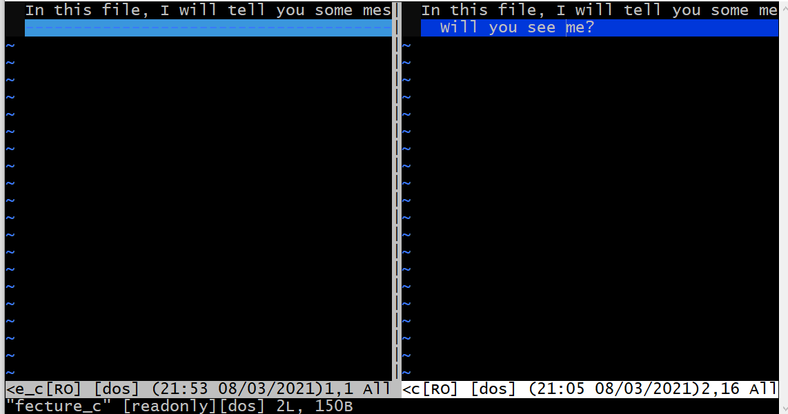

================
Git   基础操作
================

获取 Git 仓库
----------------
获取 Git 仓库通常有两种获取 Git 项目仓库的方式：

* 1.将尚未进行版本控制的本地目录转换为 Git 仓库；( ``git init``)
* 2.从其它服务器 克隆 一个已存在的 Git 仓库。（ ``git clone``）

两种方式都会在你的本地机器上得到一个工作就绪的 Git 仓库。

----

.. image:: ../../../img/git/git-command.jpg
   :alt: git-command

* workspace：工作区
* staging area：暂存区/缓存区
* local repository：版本库或本地仓库
* remote repository：远程仓库

Git 常用的是以下 6 个命令：

* ``git clone``
* ``git push``
* ``git add`` 
* ``git commit``
* ``git checkout``
* ``git pull``

----

介绍如何通过git bash创建一个存储库并进行基本操作。

* ``git init`` 初始化仓库
* ``git status`` 查看仓库的状态
* ``git add`` 向暂存区添加文件
* ``git commit`` 将暂存区的文件添加到仓库中
* ``git log`` 查看提交历史
* ``git diff`` 查看更改前后的差异

----

初始化仓库--git init
------------------------

实际建立一个目录并初始化仓库

.. code-block:: bash

   $ mkdir GitRepositoryManual
   $ cd GitRepositoryManual
   $ git init
   Initialized empty Git repository in /c/Users/qaz22/GitRepository
   /GitRepositoryManual/.git/

.. note:: 

   在 Git 中，我们将 ``.git`` 这个目录的内容称为“附属于该仓库的工作树”。文件的编辑等操作在工作树中进行，然后记录到仓库中，以此管理文件的历史快照。( **.git** 文件夹内的文件可以认为是对仓库操作的日志文件)

查看仓库状态--git status
-----------------------------

工作树和仓库在被操作的过程中，状态会不断发生变化。在 Git 操作过程中时常用 git status命令查看当前状态。(*会显示当前分支*)

.. code-block:: shell

   $ git status
   On branch main

   No commits yet

   nothing to commit (create/copy files and use "git add" to track)

.. note:: 
   ``git status -s`` 命令可查看精简的文件状态。

.. code-block:: shell

   $ git status -s
   M README
   MM Rakefile
   A lib/git.rb
   M lib/simplegit.rb
   ?? LICENSE.txt

* 输出中有两栏，左栏指明了暂存区的状态，右栏指明了工作区的状态。
* 新添加的未跟踪文件前面有 ?? 标记，新添加到暂存区中的文件前面有 A 标记，修改过的文件前面有 M 标记。

  例如，上面的状态报告显示： README 文件在工作区已修改但尚未暂存，而 lib/simplegit.rb 文件已修改且已暂存。 Rakefile 文件已修，暂存后又作了修改，因此该文件的修改中既有已暂存的部分，又有未暂存的部分。

向暂存区中添加文件--git add ( ``git add .`` :将工作区的所有变动的文件提交到暂存区)
-------------------------------------------------------------------------------------

.. code-block:: shell

   $ git add README.md
   $ git status
   # On branch main
   #
   # Initial commit
   #
   # Changes to be committed:
   # (use "git rm --cached <file>..." to unstage)
   #
   # new file: README.md
   #

保存到仓库----git commit -m 'message'
----------------------------------------

git commit命令可以将当前暂存区中的文件实际保存到仓库的历史记录中。通过这些记录，我们就可以在工作树中复原文件。

.. code-block:: shell

   $ git commit -m 'A new commit at feature-c'
   [featrue-c 50ad61b] A new commit at feature-c
   2 files changed, 3 insertions(+)
   create mode 100644 fecture_c

.. note:: 
   不妨养成这样一个好习惯：在执行 ``git commit`` 命令之前先执行 ``git diff HEAD`` 命令，查看本次提交与上次提交之间有什么差别，等确认完毕后再进行提交。同时，需要注意的是，直接执行 ``git commit`` 不带参数的命令会打开默认编辑器以对提交进行详细的信息填写。

git log
------------

不传入任何参数的默认情况下，git log 会按时间先后顺序列出所有的提交，最近的更新排在最上面。 正如你所看到的，这个命令会列出每个提交的 SHA-1 校验和、作者的名字和电子邮件地址、提交时间以及提交说明。

.. code-block:: shell

   $ git log
   commit ca82a6dff817ec66f44342007202690a93763949
   Author: Scott Chacon <schacon@gee-mail.com>
   Date: Mon Mar 17 21:52:11 2008 -0700
   changed the version number
   commit 085bb3bcb608e1e8451d4b2432f8ecbe6306e7e7
   Author: Scott Chacon <schacon@gee-mail.com>
   Date: Sat Mar 15 16:40:33 2008 -0700
   removed unnecessary test
   commit a11bef06a3f659402fe7563abf99ad00de2209e6
   Author: Scott Chacon <schacon@gee-mail.com>
   Date: Sat Mar 15 10:31:28 2008 -0700
   first commit

当然，如何提交的记录十分多，而想要查看的记录又只有前面的几条，那么在命令后加入参数以限制记录条数，格式如： ``git log -2``。
同时，通过添加参数-p该命令还可以更加详细地显示每次的提交的不同；添加参数--stat,该命令可以简略地显示每次提交的不同。

.. code-block:: shell

   $ git log -p -2
   commit 9e2e7bc32a8a0112220372a9879dafe6e135ed0e (HEAD -> main)
   Merge: 6f42ad3 86b70e6
   Author: Eugene-Forest <qazxxxxxxx@outlook.com>
   Date:   Mon Mar 8 09:21:44 2021 +0800

      fix confict

   commit 86b70e642e8ba5e102740c1898a16c9d1398634b (fecture-B)
   Author: Eugene-Forest <qazxxxxxxx@outlook.com>
   Date:   Mon Mar 8 09:14:09 2021 +0800

      commit a file whose name is date.txt at fecture-B

   diff --git a/date.txt b/date.txt
   new file mode 100644
   index 0000000..e665fe5
   --- /dev/null
   +++ b/date.txt
   @@ -0,0 +1 @@
   +Mon Mar  8 09:12:44     2021

.. code-block:: shell

   $ git log --stat -2
   commit 9e2e7bc32a8a0112220372a9879dafe6e135ed0e (HEAD -> main)
   Merge: 6f42ad3 86b70e6
   Author: Eugene-Forest <qazxxxxxxx@outlook.com>
   Date:   Mon Mar 8 09:21:44 2021 +0800

      fix confict

   commit 86b70e642e8ba5e102740c1898a16c9d1398634b (fecture-B)
   Author: Eugene-Forest <qazxxxxxxx@outlook.com>
   Date:   Mon Mar 8 09:14:09 2021 +0800

      commit a file whose name is date.txt at fecture-B

   date.txt | 1 +
   1 file changed, 1 insertion(+)

.. note::
   该命令的参数的使用较多，在这里不一样讲述。

   +-------------------+--------------------------------------------+
   |     选项参数      |                    说明                    |
   +===================+============================================+
   | -<n>              | 仅显示最近的 n 条提交。                    |
   +-------------------+--------------------------------------------+
   | --since, --after  | 仅显示指定时间之后的提交。                 |
   +-------------------+--------------------------------------------+
   | --until, --before | 仅显示指定时间之前的提交。                 |
   +-------------------+--------------------------------------------+
   | --author          | 仅显示作者匹配指定字符串的提交。           |
   +-------------------+--------------------------------------------+
   | --committer       | 仅显示提交者匹配指定字符串的提交。         |
   +-------------------+--------------------------------------------+
   | --grep            | 仅显示提交说明中包含指定字符串的提交。     |
   +-------------------+--------------------------------------------+
   | -S                | 仅显示添加或删除内容匹配指定字符串的提交。 |
   +-------------------+--------------------------------------------+

git diff
--------------

如果 git status 命令的输出对于你来说过于简略，而你想知道具体修改了什么地方，可以用 git diff 命令。

#. 查看已暂存和未暂存的修改。( ``git diff``)
#. 比对已暂存文件与最后一次提交的文件差异。( ``git diff --staged`` )

   首先，查看已暂存和未暂存的修改：

.. code-block:: shell

   $ git diff
   diff --git a/fecture_c b/fecture_c
   index d2ad9d8..6cc1c52 100644
   --- a/fecture_c
   +++ b/fecture_c
   @@ -1 +1,2 @@
   In this file, I will tell you some message about the new fecture. Actually, you can think of it as a new README.MD at fecture-c.
   +  Will you see me?

.. note:: 
   这段代码还可以通过 ``git difftool`` 来实现可视化的查看更改。

.. code-block:: shell

   $ git difftool

   This message is displayed because 'diff.tool' is not configured.
   See 'git difftool --tool-help' or 'git help config' for more details.
   'git difftool' will now attempt to use one of the following tools:
   opendiff kdiff3 tkdiff xxdiff meld kompare gvimdiff diffuse diffmerge ecmerge p4merge araxis bc codecompare smerge emerge vimdiff nvimdiff

   Viewing (1/1): 'fecture_c'
   Launch 'vimdiff' [Y/n]? y
   2 files to edit

以下是运行结果：

其次，比对已暂存文件与最后一次提交的文件差异。

.. code-block:: shell

   $ git add .
   $ git diff --staged
   diff --git a/fecture_c b/fecture_c
   index d2ad9d8..6cc1c52 100644
   --- a/fecture_c
   +++ b/fecture_c
   @@ -1 +1,2 @@
   In this file, I will tell you some message about the new fecture. Actually, you can think of it as a new README.MD at fecture-c.
   +  Will you see me?

