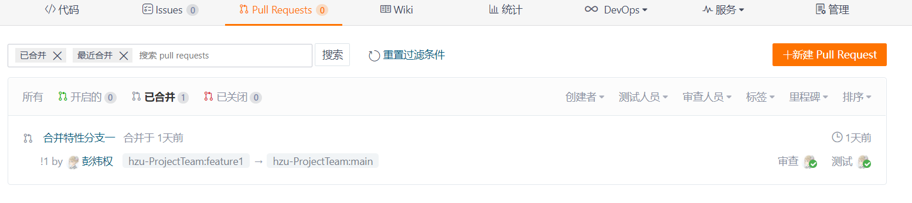
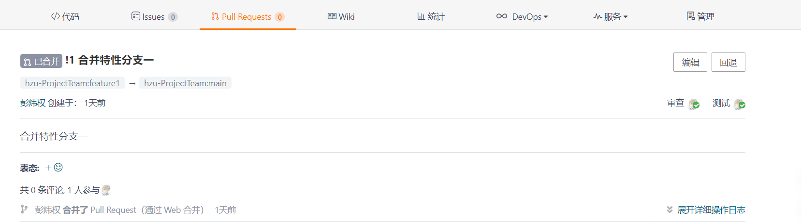
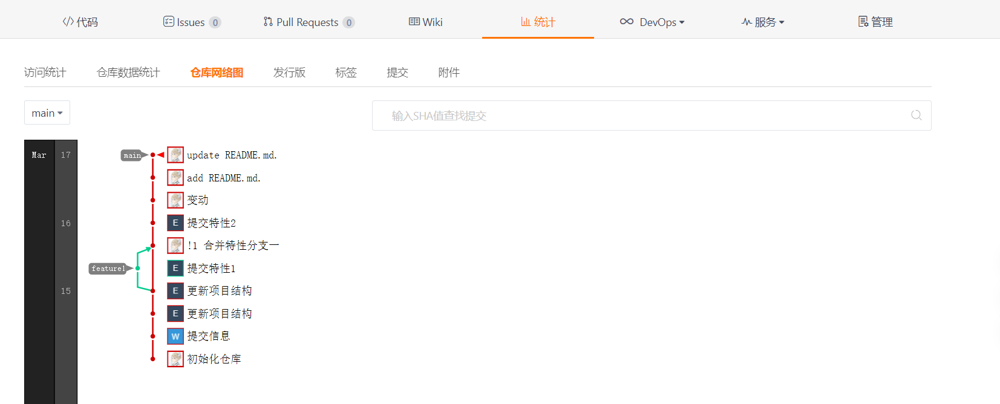

idea中，在已经对本地分支有一定的修改后拉取远程仓库，本地分支的代码会不会被远程仓库覆盖?
----------------------------------------------------------------------------------------

一般不会 。

* 当本地修改的文件与远程仓库的变动的文件都不是相同的文件时，它会在保持本地原有修改的情况下拉取新文件、修改或删除文件。
* 当本地修改的文件与远程仓库的变动的文件有相同的文件时，在idea拉取时会出现冲突处理。

.. note::
   为保证冲突处理的容错性，在对本地分支有一定的修改并且在拉取远程仓库前要将工作树提交到本地仓库。

----

在gitee中，如何回滚一次合并？
-------------------------------

首先，在gitee仓库中找到Pull Requests功能模块，点击已合并的标签，可看到合并历史。

点击需要编辑查看的合并记录，然后进入合并记录的详情界面。

可见其右侧有回滚功能。执行该功能会出现一个新的分支。

----

如何在gitee中直观的查看提交记录以及合并？
----------------------------------------------------

在gitee仓库的统计功能的仓库网络图中可查看。

