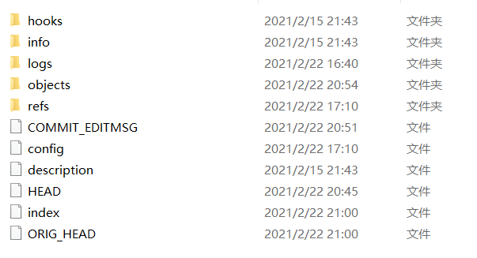

===========================================
关于Git暂存区、工作区、版本库等等名词说明
===========================================

在此之前，需要了解.git文件夹的在版本控制中起到的作用以及内容。

以下是.git文件夹下的内容

----

**工作区**:除了.git文件夹之外的内容，简单的来说就是实际写项目时操作的那些文件。

**版本库**：.git文件夹之下的文件。

**暂存区**：英文叫 stage 或 index。一般存放在 .git 目录下的 index 文件（.git/index）中，所以我们把暂存区有时也叫作索引（index）。

图中左侧为工作区，右侧为版本库。在版本库中标记为 "index" 的区域是暂存区（stage/index），标记为 "master" 的是 master 分支所代表的目录树。

图中我们可以看出此时 "HEAD" 实际是指向 master 分支的一个"游标"。所以图示的命令中出现 HEAD 的地方可以用 master 来替换。(HEAD文件的内容为 *ref: refs/heads/master* )

图中的 objects 标识的区域为 Git 的对象库，实际位于 ".git/objects" 目录下，里面包含了创建的各种对象及内容。

当对工作区修改（或新增）的文件执行 ``git add`` 命令时，暂存区的目录树被更新，同时工作区修改（或新增）的文件内容被写入到对象库中的一个新的对象中，而该对象的ID被记录在暂存区的文件索引中。

当执行提交操作（git commit）时，暂存区的目录树写到版本库（对象库）中，master 分支会做相应的更新。即 master 指向的目录树就是提交时暂存区的目录树。

当执行 ``git reset HEAD`` 命令时，暂存区的目录树会被重写，被 master 分支指向的目录树所替换，但是工作区不受影响。

当执行 ``git rm --cached <file>`` 命令时，会直接从暂存区删除文件，工作区则不做出改变。

**git checkout .** (小回滚)：用暂存区的内容格式化工作区
   当执行 ``git checkout .`` 或者 ``git checkout -- <file>`` 命令时，会用暂存区全部或指定的文件替换工作区的文件。这个操作很危险，会清除工作区中未添加到暂存区的改动。

**git checkout HEAD .** (大回滚)：用版本库的内容格式化暂存区以及工作区
   当执行 ``git checkout HEAD .`` 或者 ``git checkout HEAD <file>`` 命令时，会用 HEAD 指向的 master 分支中的全部或者部分文件替换暂存区和以及工作区中的文件。这个命令也是极具危险性的，因为不但会清除工作区中未提交的改动，也会清除暂存区中未提交的改动。

----

.. image:: ../../../img/git-command.jpg
   :alt: git-command

Git 常用的是以下 6 个命令：``git clone``、``git push``、``git add`` 、``git commit``、``git checkout``、``git pull``

workspace：工作区
staging area：暂存区/缓存区
local repository：版本库或本地仓库
remote repository：远程仓库

