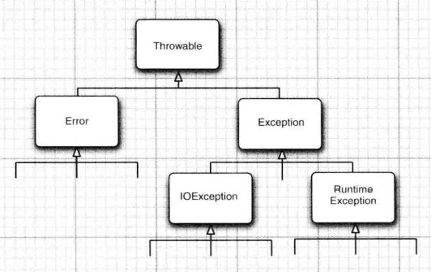

==========================================
异常、断言和日志
==========================================

人们在遇到错误时会感觉不爽。如果一个用户在运行程序期间，由于程序的错误或一些外部环境的影响造成用户数据的丢失，用户就有可能不再使用这个程序了， 为了避免这类事情的发生， 至少应该做到以下几点：

* 向用户通告错误；
* 保存所有的工作结果；
* 允许用户以妥善的形式退出程序。

|75|

处理错误和异常
====================

在 Java 程序设计语言中， 异常对象都是派生于 Throwable 类的一个实例。

    
    Java 中的异常层次结构
   

Error 类层次结构描述了 Java 运行时系统的内部错误和资源耗尽错误。 应用程序不应该抛出这种类型的对象。

在设计 Java 程序时， 需要关注 Exception 层次结构。 这个层次结构又分解为两个分支：划分两个分支的规则是：由程序错误导致的异常属于 RuntimeException ; 而程序本身没有问题， 但由于像 I/O 错误这类问题导致的异常属于其他异常。

“ 如果出现 RuntimeException 异常， 那么就一定是你的问题” 是一条相当有道理的规则。

Java 语 言 规 范 将 派 生 于 Error 类 或 RuntimeException 类的所有异常称为非受查 ( unchecked ) 异常，所有其他的异常称为受查（ checked) 异常。这是两个很有用的术语，在后面还会用到。 编译器将核查是否为所有的受査异常提供了异常处理器。

对于那些可能被他人使用的 Java 方法， 应该根据 *异常规范* （ exception specification), 在方法的首部声明这个方法可能抛出的异常。

.. code-block:: java

    class MyAnimation
    {
        ...
        
        public Image loadlmage(String s) throws FileNotFoundException, EOFException{
            ...
        }
    }

但是， 不需要声明 Java 的内部错误，即从 Error 继承的错误。任何程序代码都具有抛出那些异常的潜能， 而我们对其没有任何控制能力。同样，也不应该声明从 RuntimeException 继承的那些非受查异常。

如果在子类中覆盖了超类的一个方法， 子类方法中声明的受查异常不能比超类法中声明的异常更通用 （也就是说， 子类方法中可以抛出更特定的异常【例如超类抛出的异常类的某个子类】， 或者根本不抛出任何异常【方法中就必须捕获方法代码中出现的每一个受查异常】）。特别需要说明的是， 如果超类方法没有抛出任何受查异常， 子类也不能抛出任何受查异常。 【因为那样就不是方法重写了】

|30|

抛出异常
-------------------

不同于被动地怕抛出异常，我们可以自己创建一个异常对象来抛出：

.. code-block:: java

    public void readFile(String pathString) throws FileNotFoundException {
        if (pathString == null) {
            //deal with this situation
            return;
        }
        File file = new File(pathString);
        if (!file.exists()) {
            //如果文件不存在则抛出异常
            throw new FileNotFoundException();
        }
        //读文件
        BufferedReader bufferedReader = new BufferedReader(new FileReader(file));
        /*
        deal with file's content
         */
    }

|30|

捕获异常、再次抛出异常与异常链
-------------------------------------

通常， 出现异常时最好的选择是什么也不做，然后将异常传递给调用者。如果 read 方法出现了错误, 就让 read 方法的调用者去操心。捕获那些知道如何处理的异常， 同时将那些不知道怎样处理的异常继续进行传递。

在 catch 子句中可以抛出一个异常，这样做的目的通常是为了改变异常的类型： 如果开发了一个供其他程序员使用的子系统， 那么，用于表示子系统故障的异常类型可能会产生多种解释。

.. code-block:: java

    public String readAFile(String path) throws FilePathMistakeException {
        try {
            if (path == null || path.isEmpty()) {
                //deal with this situation
                throw new FilePathMistakeException("path is null or empty");
            }
            File file = new File(path);
            //读文件
            BufferedReader bufferedReader = new BufferedReader(new FileReader(file));
            /*
            deal with file's content
             */
            return "success";
        }catch (FileNotFoundException e){
            e.printStackTrace();
            throw new FilePathMistakeException("file's path is <"+path+"> but not found it!");
        }
    }

    class FilePathMistakeException extends Exception{
        public FilePathMistakeException() {
        }

        public FilePathMistakeException(String message) {
            super(message);
        }
    }

.. note:: 

    如果在一个方法中发生了一个受查异常， 而不允许抛出它， 那么包装技术就十分有用。我们可以捕获这个受查异常，并将它包装成一个运行时异常。

    这里所说的所谓包装技术类似于下文结构，只不过下文样例代码只是对异常进行记录后直接传递（也就是异常再抛出）：

    .. code-block:: java

        try{
            access the database
        }catch (Exception e){
            logger.log(level, message, e);
            throw e;
            // throw new otherException();
        }

|30|

finally 子句
-----------------------

**finally 子句的执行契机容易让人误会所以需要额外注意。** 实际上，在 try-catch-finally 或 try-finally 代码块中，当 try 子句调用 return 或抛出错误前【即将要结束执行try子句前】，就会调用 finally 子句。

.. code-block:: java

    public class FinallyMain {
        public static void main(String[] args) {
            System.out.println(tryFinally());
        }

        public static String tryFinally(){
            try {
                System.out.println("deal something");
                return "try code block";
            }finally {
            //不要在实际项目中的 finally 代码块中使用 return
                System.out.println("deal finally");
                return "finally code block";
            }
        }
    }
    /* code run result :
    deal something
    deal finally
    finally code block
    */

不管是否有异常被捕获，finally 子句中的代码都被执行。在下面的示例中， 程序成功打开文件后，将在所有情况下关闭文件。

.. code-block:: 

    class FileInputStreamStu {
        public static void main(String[] args) {
            try {
                System.out.println("hello exception!!");
                read();
                //unreachable
                System.out.println("goodbye exception!!");
            }catch (Exception e){
                e.printStackTrace();
            }finally {
                System.out.println("finally code");
            }
        }

        public static void read() throws Exception {
            //创建流对象
    //        FileInputStream fileInputStream = new FileInputStream("/path_to_file");
            FileInputStream fileInputStream = new FileInputStream("C:/apache-maven-3.6.3/README.txt");
            System.out.println("open the stream");
            try {
                //deal something
                throw new Exception("");
                //deal something
            }finally {
                //关闭流对象
                fileInputStream.close();
                System.out.println("close the stream");
            }
        }
    }
    /* code run result :
    hello exception!!
    open the stream
    close the stream
    finally code
    java.lang.Exception: 
        at core.base.debug.FileInputStreamStu.read(Main.java:86)
        at core.base.debug.FileInputStreamStu.main(Main.java:69)
    */

try 语句可以只有 finally 子句，而没有 catch 子句，在这种情况下，无论在 try 语句块中是否遇到异常，finally 语句块都会被执行。

这里， 强烈建议解耦合 try/catch 和 try/finally 语句块。如同上文代码中所示，这样可以提高代码的清晰度。不过，使用 finally 语句块仍然是有隐患的【也就是 finally 代码块出现的异常可能会覆盖掉 try 代码块的异常】，假设在 try 语句块中的代码抛出了一些非IOException 的异常，这些异常只有这个方法的调用者才能够给予处理。执行 finally 语句块，并调用 dose 方法。而 close 方法本身也有可能抛出 IOException 异常。当出现这种情况时， 原始的异常将会丢失，转而抛出 close 方法的异常。

|30|

带资源的 try 语句
--------------------

带资源的 try 语句（try-with-resources) 的最简形式为：

.. code-block:: java

    try (Resource res = . . .){
        work with res
    }

try块退出时，会自动调用 res.close()。

.. code-block:: java

    //改造上文FileInputStreamStu类的read方法
    public static void read() throws Exception {
        //创建流对象
        try (FileInputStream fileInputStream = new FileInputStream("C:/apache-maven-3.6.3/README.txt")){
            //deal something
            throw new Exception("");
            //deal something
        }
    }

还可以指定多个资源:

.. code-block:: java

    try (FileInputStream fileInputStream = new FileInputStream("C:/apache-maven-3.6.3/README.txt");
            FileInputStream fileInputStream2 = new FileInputStream("C:/apache-maven-3.6.3/README.txt");){
        //deal something
        throw new Exception("");
        //deal something
    }

.. note:: 

    带资源的 try 语句自身也可以有 catch 子句和一个 finally 子句。 这些子句会在关闭资源之后执行。 不过在实际中， 一个 try 语句中加入这么多内容可能不是一个好主意。

|30|

使用异常机制的技巧
--------------------

.. warning:: 
    
    早抛出，晚捕获

1) 异常处理不能代替简单的测试

    * 异常处理要比简单的测试耗时。

2) 不要过分地细化异常

    * 要将整个任务包装在一个 try 语句块。如果执行一个任务的代码块会可能抛出多个异常，那么将整个代码块包含在 try 语句块中集中处理异常要比单独将会出现异常的一个个语句包装在各自的 try 语句块中处理要好。
    * 与此同时，也要避免一个 try 语句块过于大。

3) 利用异常层次结构

    * 不要只抛出 RuntimeException 异常，应该寻找更加适当的子类或创建自己的异常类。
    * 同时也不要只捕获 Throwable 异常， 否则，会使程序代码更难读、 更难维护。
    * 考虑到已检查异常本来就很庞大，不要为逻辑错误抛出异常。
    * 将一种异常转换成另一种更加适合的异常时不要犹豫。例如， 在解析某个文件中的 一 个 整 数 时， 捕 获 NumberFormatException 异 常， 然 后 将 它 转 换 成IOException 。

4) 在检测错误时，“ 苛刻 ” 要比放任更好

    * 例如， 当栈空时，Stack.pop 是返回一个 null, 还是抛出一个异常？ 我们认为：在出错的地方抛出一个 EmptyStackException 异常要比在后面抛出一个 NullPointerException 异常更好

5) 不要压制异常

    * 不要忽略异常，既然已捕获到异常，那 catch 块理应处理并修复这个错误。catch 块整个为空，或者仅仅打印出错信息都是不妥的。程序出了错误，所有的人都看不到任何异常，但整个应用可能已经彻底坏了，这是最可怕的事情。

6) 不要羞于传递异常

    * 让高层次的方法通知用户发生了错误， 或者放弃不成功的命令更加适宜。

|50|

断言
=======================

|50|

Java 日志框架
================