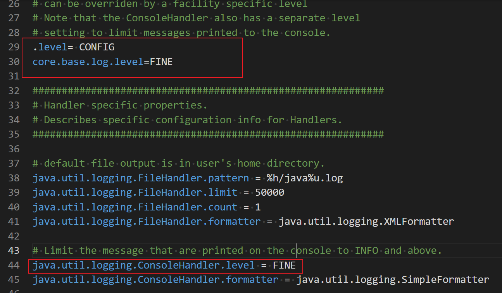

================
Java 日志框架
================

每个 Java 程序员都很熟悉在有问题的代码中插入一些 System.out.println 方法调用来帮助观察程序运行的操作过程。 当然， 一旦发现问题的根源， 就要将这些语句从代码中删去。如果接下来又出现了问题， 就需要再插入几个调用 System.out.println方法的语句。记录日志API 就是为了解决这个问题而设计的。

* 可以很容易地取消全部日志记录，或者仅仅取消某个级别的日志，而且打开和关闭这个操作也很容易。
* 可以很简单地禁止日志记录的输出， 因此，将这些日志代码留在程序中的开销很小。
* 日志记录可以被定向到不同的处理器， 用于在控制台中显示， 用于存储在文件中等。
* 日志记录器和处理器都可以对记录进行过滤。过滤器可以根据过滤实现器制定的标准丢弃那些无用的记录项。
* 日志记录可以采用不同的方式格式化，例如，纯文本或 XML。
* 应用程序可以使用多个日志记录器， 它们使用类似包名的这种具有层次结构的名字，例如， com.mycompany.myapp
* 在默认情况下，日志系统的配置由配置文件控制。如果需要的话， 应用程序可以替换这个配置。

|75|

简单的日志记录
=====================

要生成简单的日志记录，可以使用全局日志记录器（global logger) 并调用日志方法：

.. literalinclude:: ../example_java/basic/logger/LogMain.java
    :language: java
    :caption: 全局日志记录的使用

|50|

高级日志
======================

在一个专业的应用程序中，不要将所有的日志都记录到一个全局日志记录器中，而是可以自定义日志记录器。

可以调用 getLogger 方法创建或获取记录器：

``private static final Logger myLogger = Logger.getLogger("com.mycompany.myapp");``

.. attention:: 

    未被任何变量引用的日志记录器可能会被垃圾回收。 为了防止这种情况发生，要像上面的例子中一样， 用一个静态变量存储日志记录器的一个引用。

与包名类似，日志记录器名也具有层次结构。事实上， 与包名相比，日志记录器的层次性更强。 对于包来说，一个包的名字与其父包的名字之间没有语义关系，但是日志记录器的父与子之间将共享某些属性。例如， 如果对 com.mycompany 日志记录器设置了日志级别，它的子记录器也会继承这个级别。

.. note:: 

    有以下 7 个日志记录器级别：

    * SEVERE
    * WARNING
    * INFO
    * CONFIG
    * FINE
    * FINER
    * FINEST

    在默认情况下，只记录前3个级别，日志处理器不会处理低于 INFO 级别的信息。 当然，也可以设置日志最低级别为其他的级別，例如： ``logger.setLevel(Level.FINE);`` ；当执行了这个语句后，所有等级大于或等于 FINE 的日志都会被记录。

    另外，可以使用 Level.ALL 开启所有级别的记录， 或者使用 ``Level.OFF`` 关闭所有级别的记录。

|50|

修改日志管理器配置
============================

可以通过编辑配置文件来修改日志系统的各种属性。在默认情况下，配置文件存在于 ``jre/lib/logging.properties`` 。 :download:`java version "1.8.0_281" 的 logging.properties <../example_java/basic/logger/logging.properties>` 

直接修改jre的配置可能比较危险，我们可以复制该配置文件到自己的临时工作区，然后对此文件修改成另一个（自定义）配置文件， 同时我们需要将 ``java.util.logging.config.file`` 特性设置为此配置文件的存储位置， 并用下列命令启动应用程序:

``java -Djava.util.logging.config.file=configFile_path MainClass``

.. warning:: 

    日志管理器在 VM 启动过程中初始化， 这在 main 执行之前完成。 如果在 main 中调用 ``System.setProperty("java.util.logging.config.file",file)``, 也 会 调 用 ``LogManager.readConfiguration()`` 来重新初始化日志管理器。

.. note:: 

    在 IDE 中，通过编辑运行或调试配置来设置 VM 选项 ( ``-Djava.util.logging.config.file=configFile_path`` )。当然也可以直接通过命令行添加运行所需的 VM 选项。

要想修改默认的日志记录级别， 就需要编辑配置文件，并修改命令 ``.level=INFO`` 为期望等级。同时，我们可以通过添加代码行中的内容来指定自己的日志记录器的日志记录级别 ``com.mycompany.myapp.level=FINE`` ,也就在日志记录器名后面添加后缀 ``.level``。

我们需要特别注意的是，日志记录并不将消息发送到控制台上，这是处理器的任务。另外，处理器也有级别。要想在控制台上看到 FINE 级别的消息， 就需要进行下列设置 ``java.util.logging.ConsoleHandler.level=FINE`` ；将处理器的日志处理级别调整到 ``FINE``

.. literalinclude:: ../example_java/basic/logger/TestMain.java
    :language: java
    :caption: TestMain

    自定义的 logging.properties 配置文件

.. note:: 

    **在日志管理器配置的属性设置不是系统属性**， 因此， 用 ``-Dcom.mycompany.myapp.level= FINE`` 启动应用程序不会对日志记录器产生任何影响。

|50|

处理器
===============

与日志记录器一样，处理器也有日志记录级别。对于一个要被记录的日志记录，它的日志记录级别必须高于日志记录器和处理器的阈值。日志管理器配置文件设置的默认控制台处理器的日志记录级别为 *INFO* 。

在默认情况下， 日志记录器将记录发送到 ConsoleHandler 中， 并由它输出到 System.err 流中。 **特别是，日志记录器还会将记录发送到父处理器中** ，而最终的处理器（命名为“ ”）有一个 ConsoleHandler。

在默认情况下， 日志记录器将记录发送到自己的处理器和父处理器。我们的日志记录器是原始日志记录器（命名为“ ”）的子类， 而原始日志记录器将会把所有等于或高于 *INFO* 级別的记录发送到控制台。然而， 我们并不想两次看到这些记录。 鉴于这个原因，应该将 *useParentHandlers* 属性设置为 *false*

.. code-block:: java
    :caption: TestMain2

    //将上方TestMain代码中的main函数替换
    public static void main(String[] args) {
        List<String> list= Arrays.asList("12443039","eugene-forest");
        //测试全局记录器
        Logger.getGlobal().setUseParentHandlers(false);
        Logger.getGlobal().info("---global--");
        run(list,Logger.getGlobal());
        customizeLogger.setUseParentHandlers(false);
        //测试自定义记录器
        customizeLogger.info("---custom--");
        run(list,customizeLogger);
    }
    /**
     * run code result : [result as follows with nothing]
     *
     */

.. code-block:: java
    :caption: TestMain3

    //将TestMain代码中的main函数替换
    public static void main(String[] args) {
        List<String> list= Arrays.asList("12443039","eugene-forest");
        //测试全局记录器
        Logger.getGlobal().setUseParentHandlers(false);
        Logger.getGlobal().info("---global--");
        run(list,Logger.getGlobal());
    //        customizeLogger.setUseParentHandlers(false);
        ConsoleHandler myHandler=new ConsoleHandler();
        customizeLogger.addHandler(myHandler);
        //测试自定义记录器
        customizeLogger.info("---custom--");
        run(list,customizeLogger);
    }
    /** run code result :
    十一月 30, 2021 9:13:09 上午 core.base.log.TestMain main
    信息: ---custom--
    十一月 30, 2021 9:13:09 上午 core.base.log.TestMain main
    信息: ---custom--
    ...
    十一月 30, 2021 9:13:09 上午 core.base.log.TestMain run
    信息: finish function!
    十一月 30, 2021 9:13:09 上午 core.base.log.TestMain run
    信息: finish function!
        */

要想将日志记录发送到其他地方， 就要添加其他的处理器。日志 API 为此提供了两个很有用的处理器， 一个是 FileHandler ; 另一个是 SocketHandler。SocketHandler 将记录发送到特定的主机和端口，这个暂时不详细展开。而 FileHandler 则是一种十分重要且常用的处理器。

.. csv-table:: 文 件 处 理 器 配 置 参 数
    :file: ../example_java/basic/logger/FileHandler.csv
    :header-rows: 1

.. table:: 日志记录文件模式变量

    +------+----------------------------------------------------------------------------+
    | 变量 |                                   描 述                                    |
    +======+============================================================================+
    | %h   | 系统属性 user.home 的值                                                    |
    +------+----------------------------------------------------------------------------+
    | %t   | 系统临时目录                                                               |
    +------+----------------------------------------------------------------------------+
    | %u   | 用于解决冲突的唯一编号                                                     |
    +------+----------------------------------------------------------------------------+
    | %g   | 为循环日志记录生成的数值。（当使用循环功能且模式不包括 %g 时， 使用后缀%g) |
    +------+----------------------------------------------------------------------------+
    | %%   | % 宇符                                                                     |
    +------+----------------------------------------------------------------------------+

如果多个应用程序 （或者同一个应用程序的多个副本）使用同一个口志文件， 就应该开启 append 标志。 另外， 应该在文件名模式中使用 ％u, 以便每个应用程序创建日志的唯一副本。

开启文件循环功能也是一个不错的主意。日志文件以 myapp.log.0, myapp.log.1 , myapp.log.2, 这种循环序列的形式出现 ， 只要文件超出了大小限制， 最旧的文件就会被删除， 其他的文件将重新命名， 同时创建一个新文件， 其编号为 0。

.. code-block:: java
    :caption: TestMain4--将日志打印到文件中

    public static void main(String[] args) {
        List<String> list= Arrays.asList("12443039","eugene-forest");
        try {
            customizeLogger.setUseParentHandlers(false);
            FileHandler myHandler=new FileHandler("C:/MyTempFile/Java/Log/java%u.log");
            customizeLogger.addHandler(myHandler);
            //测试自定义记录器
            customizeLogger.info("---custom--");
            run(list,customizeLogger);
        } catch (IOException e) {
            e.printStackTrace();
        }
    }