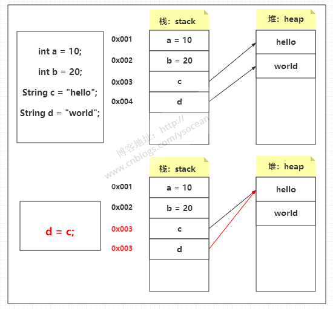

==========================
函数传值与深拷贝、浅拷贝
==========================

我们在对象与对象直接协作时，一个对象常需要获得另一个对象的私有成员变量。那么另外的那个对象就需要定义一个 Getter 函数，但是需要注意的是，对于返回成员对象和数组类型的 Getter 函数，我们通常是不能也不建议直接返回成员变量的，因为这样会破坏类对象的封装性。

首先，我们需要了解在Java中哪些数据类型在函数传值的过程中是传递对象地址。

|75|

Java中的“传值”和“传引用”问题
=====================================

对于 Java 函数中的参数究竟是“传值”还是“传引用”，有以下两点定论：
    * 在Java中，当 :ref:`基本类型 <java-basic-datatype-and-class>`  作为参数传入方法时，无论该参数在方法内怎样被改变，外部的变量原型总是不变的，这就叫做“值传递”，即方法操作的是参数变量（也就是原型变量的一个值的拷贝）改变的也只是原型变量的一个拷贝而已，而非变量本身。所以变量原型并不会随之改变。
    * 当方法传入的参数为非基本类型时（也就是说是一个对象类型的变量）， 方法里面改变参数变量的同时变量原型也会随之改变。这种特性就叫做“引用传递”，也叫做 **传址**，即方法操作参数变量时是拷贝了变量的引用。

.. literalinclude:: ../example_java/extend/ValueMain.java
    :language: java
    :caption: String 字符串对象和基本类型的“值传递”
    :linenos: 

有人看到上面代码运行结果可能会有疑问，String 字符串对象为什么也可以实现 “值传递” ？其实这和 Java String 类的实现方式有关， 点击查看 :ref:`String 的定义 <realize-string>` 或通过 JDK 文档查看 String 的定义，我们会发现 String 类对象的值是存储在 char 类型数组中的，而且这个数组和类是由 final 修饰的，也就是说， *字符串一旦定义则不可变。*

|30|

Java 中将实参传递给方法（或函数）的方式是值传递 [#]_
-------------------------------------------------------

如果有学过C++，那么肯定觉得 Java 对引用类型的参数采用的是引用传递。实际上，并不是的，这里传递的还是值，不过，这个值是实参的地址罢了！

程序设计语言将实参传递给方法（或函数）的方式分为两种： 
    * 值传递 ：方法接收的是实参值的拷贝，会创建副本。 
    * 引用传递 ：方法接收的直接是实参所引用的对象在堆中的地址，不会创建副本，对形参的修改将影响到实参。 很多程序设计语言（比如 C++、 Pascal )提供了两种参数传递的方式，不过，在 Java 中只有值传递。

.. code-block:: java
    :caption: 验证 Java 实参传递给方法（或函数）的方式是值传递的测试代码
    :linenos:

    public static void main(String[] args) {
        Department department1=new Department(1244,"1244");
        Department department2=new Department(2399,"2399");
        swap(department1,department2);
        System.out.println("--------original after swap-------");
        swapPrinter(department1,department2);

        String message1="message1";
        String message2="message2";
        swap(message1,message2);
        System.out.println("--------original after swap-------");
        swapPrinter(message1,message2);

        int i1=12;
        int i2=13;
        swap(i1,i2);
        System.out.println("--------original after swap-------");
        swapPrinter(i1,i2);
    }

    public static <T> void swap(T first,T second){
        System.out.println("-----execute swap function----");
        T temp=first;
        first=second;
        second=temp;
        swapPrinter(first,second);
    }

    public static <T> void swapPrinter(T first, T second){
        System.out.println("first object is: "+first);
        System.out.println("second object is: "+second);
    }

.. code-block:: guess
    :caption: 运行结果

    -----execute swap function----
    first object is: Department{id=2399, name='2399'}
    second object is: Department{id=1244, name='1244'}
    --------original after swap-------
    first object is: Department{id=1244, name='1244'}
    second object is: Department{id=2399, name='2399'}
    -----execute swap function----
    first object is: message2
    second object is: message1
    --------original after swap-------
    first object is: message1
    second object is: message2
    -----execute swap function----
    first object is: 13
    second object is: 12
    --------original after swap-------
    first object is: 12
    second object is: 13

Java 中将实参传递给方法（或函数）的方式是值传递 ： 
    简单来说，如果参数是基本类型的话，很简单，传递的就是基本类型的字面量值的拷贝，会创建副本。 如果参数是引用类型，传递的就是实参所引用的对象在堆中地址值的拷贝，同样也会创建副本。

.. note:: 
    
    理解这些需要了解 Java 的栈和堆。JVM里的堆（heap）特指用于存放Java对象的内存区域。所以根据这个定义，Java对象全部都在堆上。而栈中保存的是基本类型或自定义对象的引用（地址），而自定义对象的引用则指向堆。Java 中传递给方法（或函数）的实参是将拷贝后的栈中的值。

|50|

通过实现 Cloneable 接口进行拷贝 [#]_
========================================

简单来说，在Java中，拷贝就是创建一个和已知对象一模一样的对象，而拷贝有深拷贝和浅拷贝之分。

Java 将内存空间分为堆和栈。基本类型直接在栈中存储数值，而引用类型是将引用放在栈中，实际存储的值是放在堆中，通过栈中的引用指向堆中存放的数据。

    
    clone

|30|

浅拷贝
-------------------

浅拷贝
    创建一个新对象，然后将当前对象的非静态字段复制到该新对象，如果字段是值类型（即是 Java 基本类型或 String 类型的）的，那么对该字段执行复制；如果该字段是引用类型的话，则复制引用但不复制引用的对象，原始对象及其副本引用同一个对象。

.. note:: 

    浅拷贝之所以称之为浅拷贝，那便是他不能彻底拷贝一个对象。通过浅拷贝获得的拷贝对象的存储仍然与源对象的存储有交叉。参考下文中的 :ref:`浅拷贝示例 <java-extend-shallow-copy-example>` 。

.. code-block:: java
    :caption: 拷贝示例类 Department
    :name: java-extend-department
    :linenos: 

    public class implements Cloneable{

        private int id;
        private String name;
    
        public Department(int id, String name)
        {
            this.id = id;
            this.name = name;
        }

        @Override
        protected Object clone() throws CloneNotSupportedException {
            return super.clone();
        }

        @Override
        public String toString() {
            return "Department{" +
                    "id=" + id +
                    ", name='" + name + '\'' +
                    '}';
        }
    
        //Getters and Setters
    }

.. code-block:: java
    :caption: 拷贝示例类 Employee 
    :name: java-extend-employee
    :linenos: 

    public class Employee implements Cloneable{
    
        private int empoyeeId;
        private String employeeName;
        private Department department;
    
        public Employee(int id, String name, Department dept)
        {
            this.empoyeeId = id;
            this.employeeName = name;
            this.department = dept;
        }
        @Override
        protected Object clone() throws CloneNotSupportedException {
            return super.clone();
        }
        
        //Getters and Setters
    }

.. code-block:: java
    :caption: 浅拷贝示例
    :name: java-extend-shallow-copy-example
    :linenos: 

    public static void main(String[] args) throws CloneNotSupportedException {
        Department hr = new Department(1, "Human Resource");

        Employee original = new Employee(1, "Admin", hr);
        Employee cloned = (Employee) original.clone();

        //Let change the department name in cloned object and we will verify in original object
        cloned.getDepartment().setName("Finance");

        System.out.println(original.getDepartment().getName()); //Finance
        System.out.println(cloned.getDepartment().getName());  //Finance
    }

需要注意的是，一些对象（该对象的属性都是基本类型或String）的浅拷贝的表现类似于深拷贝。

.. code-block:: java
    :caption: 浅拷贝示例2
    :linenos: 

    public static void main(String[] args) throws CloneNotSupportedException {
        Department hr = new Department(1, "Human Resource");
        Department department= (Department) hr.clone();

        department.setId(1244);
        department.setName("1244");

        System.out.println(hr); //Department{id=1, name='Human Resource'}
        System.out.println(department); //Department{id=1244, name='1244'}
    }

|30|

深拷贝
-----------------

深拷贝
    创建一个新对象，然后将当前对象的非静态字段复制到该新对象，无论该字段是值类型的还是引用类型，都复制独立的一份。当你修改其中一个对象的任何内容时，都不会影响另一个对象的内容。

深拷贝示例依旧使用拷贝示例类 :ref:`Employee <java-extend-employee>`  和 :ref:`Department <java-extend-department>` ；唯一区别在于 Employee 类的 clone 方法需要重写成以下形式：

.. code-block:: java
    :caption: 拷贝示例类 Employee 类的 clone 方法重写
    :linenos: 

    @Override
    protected Object clone() throws CloneNotSupportedException {
        Employee cloned = (Employee)super.clone();
        cloned.setDepartment((Department)cloned.getDepartment().clone());
        return cloned;
    }

.. code-block:: java
    :caption: 深拷贝示例
    :linenos: 

    public static void main(String[] args) throws CloneNotSupportedException {
        Department hr = new Department(1, "Human Resource");
        Department department= (Department) hr.clone();

        department.setId(1244);
        department.setName("1244");

        System.out.println(hr); //Department{id=1, name='Human Resource'}
        System.out.println(department); //Department{id=1244, name='1244'}
    }

.. code-block:: java
    :caption: 深拷贝示例2（同浅拷贝示例）
    :name: java-extend-deep-copy-example
    :linenos: 

    public static void main(String[] args) throws CloneNotSupportedException {
        Department hr = new Department(1, "Human Resource");

        Employee original = new Employee(1, "Admin", hr);
        Employee cloned = (Employee) original.clone();

        //Let change the department name in cloned object and we will verify in original object
        cloned.getDepartment().setName("Finance");

        System.out.println(original.getDepartment().getName()); //Human Resource
        System.out.println(cloned.getDepartment().getName());  //Finance
    }

这种做法有个弊端，这里我们 Employee 类只有一个 Department 引用类型，而 Department 类没有，所以我们只用重写 Department 类的 clone 方法，但是如果 Department 类也存在一个引用类型，那么我们也要重写其 clone 方法，这样下去，有多少个引用类型，我们就要重写多少次，如果存在很多引用类型，那么代码量显然会很大，所以这种方法不太合适对已有代码进行修改。

|50|

通过实现 Serializable 接口进行深拷贝 
========================================

序列化是将对象写到流中便于传输，而反序列化则是把对象从流中读取出来。这里写到流中的对象则是原始对象的一个拷贝，因为原始对象还存在 JVM 中，所以我们可以利用对象的序列化产生克隆对象，然后通过反序列化获取这个对象。

通过实现 Serializable 接口进行拷贝 ，即通过序列化实现拷贝，通过序列化实现的拷贝一定是深拷贝。因为序列化产生的是两个完全独立的对象，所有无论嵌套多少个引用类型，序列化都是能实现深拷贝的。

实现序列化的方法
  1. 实现Serializable接口
       * 该接口是一个可序列化的标志，并没有包含实际的属性和方法。
       * 如果不在该方法中添加readObject()和writeObject()方法，则采取默认的序列化机制。如果添加了这两个方法之后还想利用Java默认的序列化机制，则在这两个方法中分别调用defaultReadObject()和defaultWriteObject()两个方法。
       * 为了保证安全性，可以使用transient关键字进行修饰不必序列化的属性。因为在反序列化时，private修饰的属性也能被查看到。

  2. 实现ExternalSerializeable方法
       * 自己对要序列化的内容进行控制，控制哪些属性能被序列化，哪些不能被序列化。

.. code-block:: java
    :caption: 实现序列化接口的 Department 类
    :linenos: 

    public class Department implements Serializable
    {
        private int id;
        private String name;

        public Department(int id, String name)
        {
            this.id = id;
            this.name = name;
        }

        //Getters and Setters and toString
    }

.. code-block:: java
    :caption: 实现序列化接口的 Employee 类
    :linenos: 

    public class Employee implements Serializable {

        private int empoyeeId;
        private String employeeName;
        private Department department;

        public Employee(int id, String name, Department dept)
        {
            this.empoyeeId = id;
            this.employeeName = name;
            this.department = dept;
        }

        //Getters and Setters and toString
    }

.. code-block:: java
    :caption: 通过序列化实现深拷贝示例
    :linenos: 
    
    public class DeepCopyMain {
        public static void main(String[] args) throws Exception {
            Department hr = new Department(1, "Human Resource");
            Employee original = new Employee(1, "Admin", hr);
            Employee cloned = deepClone(original);

            cloned.getDepartment().setName("Finance");

            System.out.println(original); 
            //Employee{empoyeeId=1, employeeName='Admin', department=Department{id=1, name='Human Resource'}}
            System.out.println(cloned); 
            //Employee{empoyeeId=1, employeeName='Admin', department=Department{id=1, name='Finance'}}
        }

        //深度拷贝
        public static <T extends Serializable> T deepClone(T origin) throws Exception{
            // 序列化
            ByteArrayOutputStream bos = new ByteArrayOutputStream();
            ObjectOutputStream oos = new ObjectOutputStream(bos);

            oos.writeObject(origin);

            // 反序列化
            ByteArrayInputStream bis = new ByteArrayInputStream(bos.toByteArray());
            ObjectInputStream ois = new ObjectInputStream(bis);

            //需要处理类型变换异常
            T object = (T) ois.readObject();
            return object;
        }
    }

----

.. [#] 引用自 JavaGuide 文章： `为什么 Java 只有值传递？ <https://javaguide.cn/java/basis/why-there-only-value-passing-in-java/#%E4%B8%BA%E4%BB%80%E4%B9%88-java-%E5%8F%AA%E6%9C%89%E5%80%BC%E4%BC%A0%E9%80%92>`_ 
.. [#] 引用自 博客园 文章： `Java的深拷贝和浅拷贝 <https://www.cnblogs.com/ysocean/p/8482979.html>`_ 

