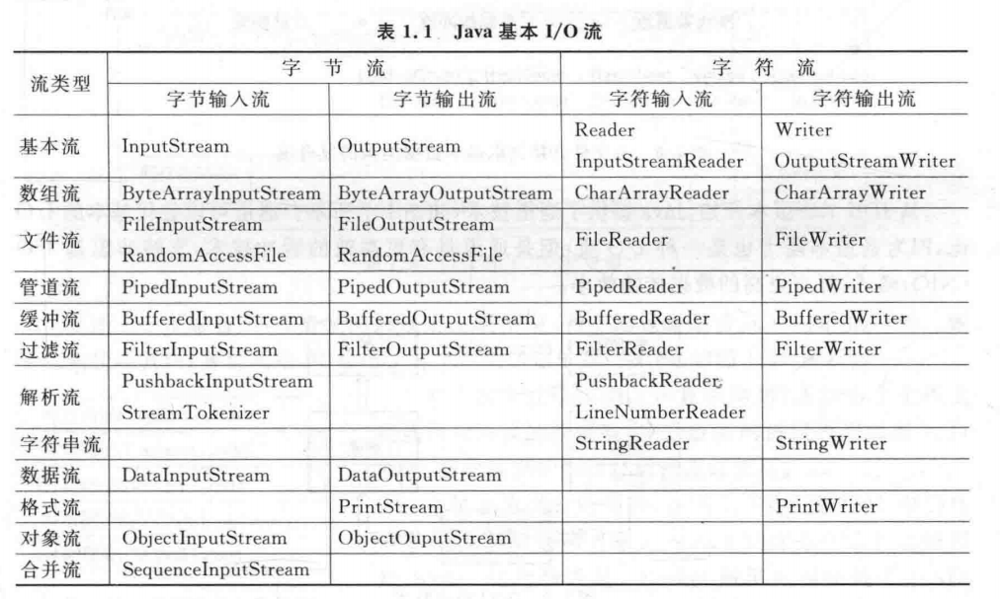
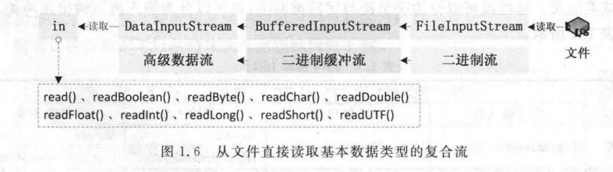

================================
知识准备
================================

java IO 流
-----------------

以下是java的基本IO流：

----

举例子，我们在对一个文件进行数据读取时，使用的是FileInputStream,但是使用该类获取的数据是字节流/二进制流，我们在读取文件数据时只能通过字节来读取；如果希望提高读取效率可以使用BufferedInputStream作为二级流，对输入缓冲流提供更多控制。当然，如果希望直接从文件中返回各种基本类型的数据，可以使用DataInputStream作为三级流。

.. code-block:: java

   //构建文件输入流
   DataInputStream in=new DataInputStream(new BufferedInputStream(new FileInputStream()));

.. note:: 
   多重封装的好处是提高程序效率；在网络通讯程序中，字符流对一句话的传输比字节流一个字节一个字节得传输要好，有缓冲得BufferedInputStream要比没有缓冲的InputStream要好。以上三重封装适用于文本以及文本文件的传输，对于非文本文件的传输需要另外考虑。

java 多线程
-----------------

java socket
------------------

