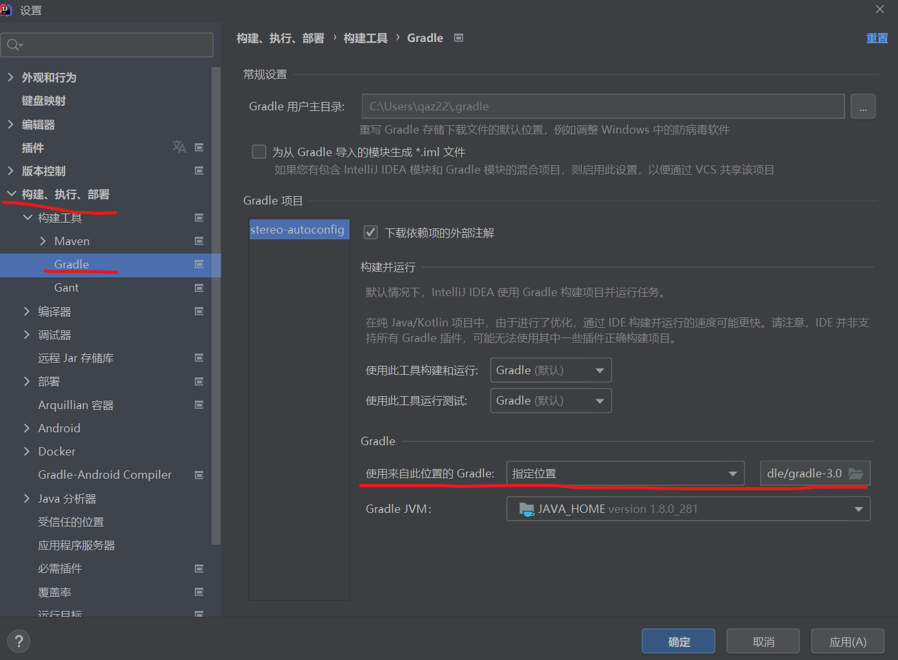

=================================
如何运行 spring 实战4的示例代码
=================================

首先，需要准备的有：

* Gradle 3.0 的软件包 （Gradle版本不要太新）
* Idea 2020以上

.. note:: 

   未能在 eclipse 中实现示例项目运行。

笔者在实际使用的版本为 Idea 2021.1，至于为何使用 Gradle 3.0 , 笔者在 Idea 运行项目时自动安装的，推测为适配的最低版本。

举例
===========

如章节1 knight 项目 以及 章节2的 stereo-autoconfig 项目。

* 方法一 ：通过改变项目文件夹 gradle/gradle-wrapper.properties 文件的distributionUrl属性
* 方法二 ：自己下载一个版本合适的 gradle（3.0及其以上，但是不要太新），然后再idea的配置中更改构建工具

方法一
-------

knight 项目 的 Gradle 是通过 Idea 下载的，其通过改变项目文件夹 gradle/gradle-wrapper.properties 文件的distributionUrl属性为 ``distributionUrl=https\://services.gradle.org/distributions/gradle-3.0-bin.zip`` ；然后重新构建项目————加载 Gradle 变更（即点击 build.gradle 文件中右上角的 gradle 小图标；或者右边侧边栏的 gradle 选项的 build）

方法二
--------

然后重新构建项目————加载 Gradle 变更（即点击 build.gradle 文件中右上角的 gradle 小图标；或者右边侧边栏的 gradle 选项的 build）