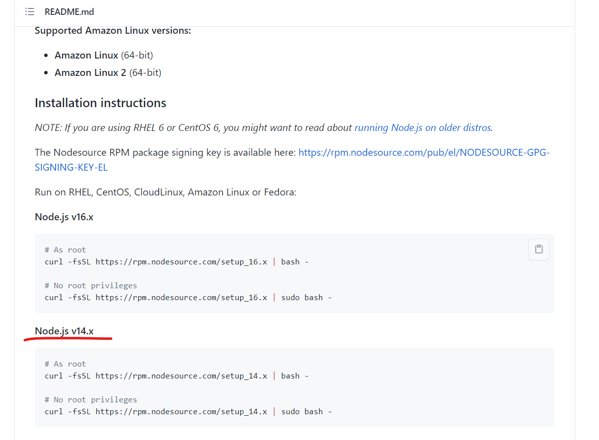
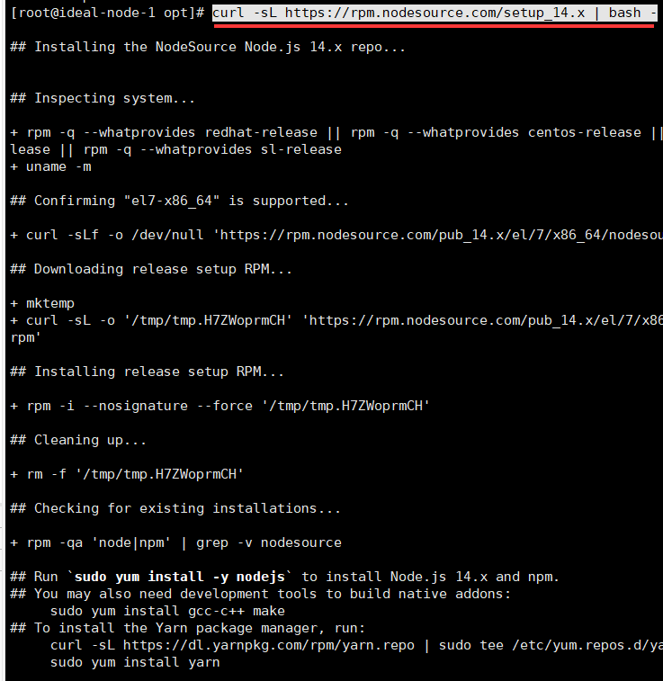
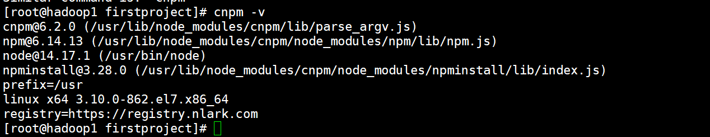
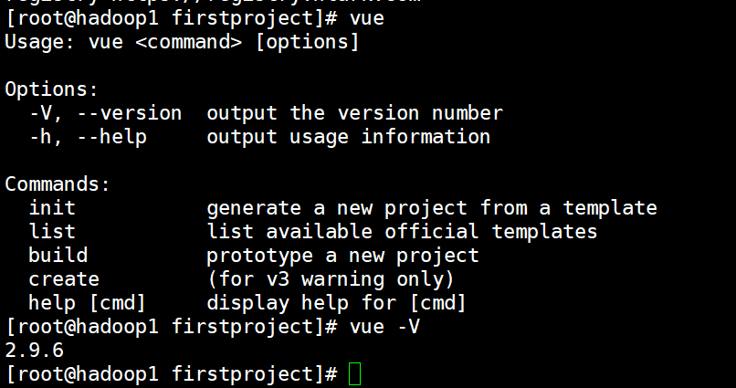
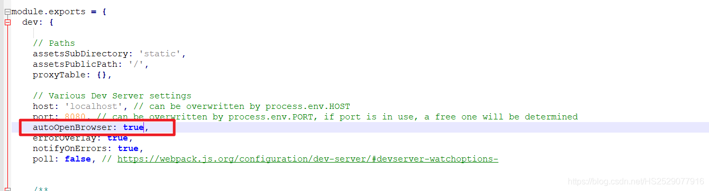
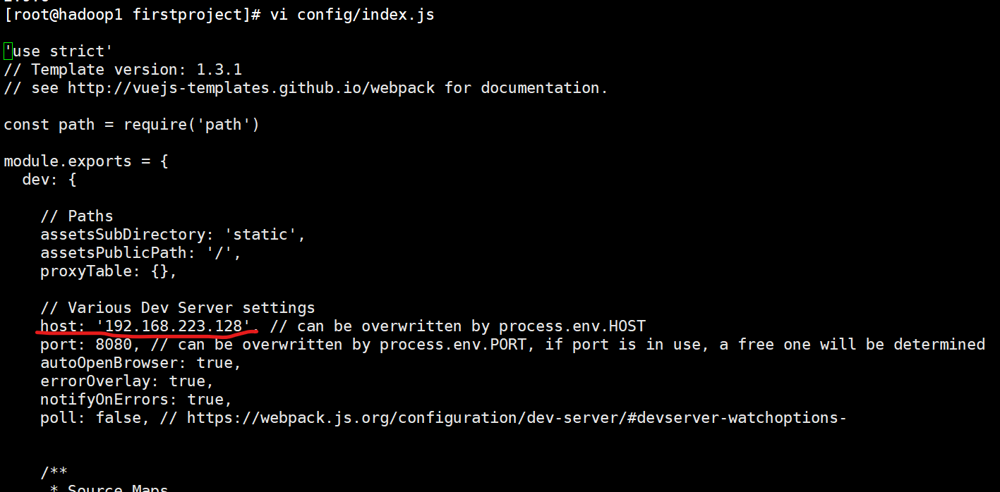

======================================
在Linux下vue项目的环境配置和运行
======================================

.. note:: 

   本章节Linux为 CentOS 7.x

vue项目运行环境的简易配置
===============================

安装nodejs和npm
-----------------------

从链接中获取最新命令
`Enterprise Linux based distributions --Installation instructions <https://github.com/nodesource/distributions#rpminstall>`_  

.. note:: 

   需要注意的是，这个对不同的Linux版本系统的支持是不同的，在使用之前查看一下被支持的Linux系统都有哪些。（在图片/链接所示网页中）

.. code-block:: bash

   # As root
   curl -fsSL https://rpm.nodesource.com/setup_14.x | bash -

   # No root privileges
   curl -fsSL https://rpm.nodesource.com/setup_14.x | sudo bash -

然后，通过命令 ``yum -y install nodejs`` 或 ``sudo yum -y install nodejs`` 下载 nodejs 。

安装完成后，通过命令 ``node -v`` 和 ``npm -v`` 验证安装是否成功。

替代默认NPM镜像为淘宝NPM镜像
-------------------------------

首先，我们可以通过命令查看当前镜像地址： ``npm get registry``。

替换命令为：``npm config set registry http://registry.npm.taobao.org/`` 

如果想恢复原来的镜像地址：``npm config set registry https://registry.npmjs.org/``

用淘宝定制的cnpm工具来代替默认的npm
----------------------------------------

命令： ``npm install -g cnpm --registry=https://registry.npm.taobao.org``

验证安装成功： ``cnpm -v``

安装vue-cli 
------------------------------------------

安装命令： ``cnpm install -g vue-cli``

验证安装成功： ``vue -V`` or ``vue``

构建vue项目遇到的问题
============================================

"Vue中 I Your application is running here: http://localhost:8080 便不运行/卡住"
---------------------------------------------------------------------------------

解决办法：目录中config下的index.js修改如下

将autoOpenBrowser:false ;改为true

Linux&服务器vue项目外部无法访问
--------------------------------------------------

编辑项目中的 config/index.js

将host后面修改为 自己ip地址

