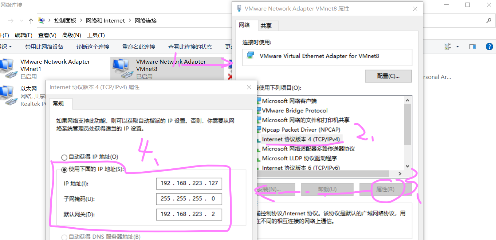

==========================================================
在使用校园网或其他需要验证的局域网的主机内使用虚拟机
==========================================================

 因为在选修 Linux 的时候初次使用 VMware [#]_ 工作台使用，在选择网络适配器的时候都是直接选择桥接模式（未经过更多配置，只是在工作台选择网络适配器），这种模式简单，但是比较适合在可以连接开放网络的情况下。每当我需要使用虚拟机上网时，只能自己开热点，十分麻烦。

.. note:: 

   在网上曾发现有人通过桥接模式成功使用校园网上网，不过本文展示不涉及此模式的实现。等将来有时间再对桥接模式继续深入了解。

首先，直接进入正题，我们将采用 NAT 模式的网络适配器来通过 本机 [#]_ 的网络来连接Internet。

.. _NAT模式上网配置:

NAT 模式下使用本机校园网
=============================

具体步骤如下：

#. 将虚拟机的网络适配器改为 NAT 模式
#. 通过 VMWare 工作台打开 虚拟网络编辑器，获取 VMnet8 的信息
#. 打开本机的网络连接控制面板，对 VMware Network Adapter VMnet8 的 Ipv4 进行修改
#. 将本机连接外部网络的网络设备对其共享
#. 验证虚拟机可以上网

将虚拟机的网络适配器改为 NAT 模式
--------------------------------------

通过 VMWare 工作台打开 虚拟网络编辑器，获取 VMnet8 的信息
--------------------------------------------------------------------------

.. image:: ../../../img/linux/question/nat_ip_set.png
   :alt: DHCP 设置

点击如上图的 DHCP 设置 按钮进入设置界面，我们可以知道到 **虚拟机的ip地址可设置的范围为192.169.223.128~192.168.223.254**，同时 **子网掩码为255.255.255.0**

点击如上图的 NAT 设置 按钮进入设置界面，我们可以知道到虚拟机的 **网关地址设置为 192.168.223.2**

打开本机的网络连接控制面板，对 VMware Network Adapter VMnet8 的 Ipv4 进行修改
----------------------------------------------------------------------------------

本机的网络连接控制面板如下所示：

.. image:: ../../../img/linux/question/network_pane.png
   :alt: 网络连接控制面板

对 VMware Network Adapter VMnet8 的 Ipv4 进行修改,需要修改的信息有 ip地址(该ip地址在子网192.168.223.0内，但是不要于192.169.223.128~192.168.223.254范围内，且不与网关192.168.223.2相同)，子网掩码255.255.255.0，网关地址192.168.223.2；其值参考之前获取的数值。

.. note:: 

   以我的理解，VMware Network Adapter VMnet8 设置的地址是作为与虚拟机通信的本机ip地址（这与路由器一样，跨域的路由器是有多个ip地址的）；

将本机连接外部网络的网络设备对其共享
------------------------------------

.. image:: ../../../img/linux/question/network_share.png
   :alt: 本机连接

验证虚拟机可以上网
----------------------

.. image:: ../../../img/linux/question/ping.png
   :alt: ping

NAT 模式下的DHCP自动分配ip地址给虚拟机的服务没有启动
========================================================

`参考博客 VMware下网络模式配置与IP地址无法正常获取及解决方案 小番茄C2018-01-15 09:18:06©著作权 <https://blog.51cto.com/u_13570219/2060937>`_ 

上一节我们提到，我们通过NAT模式的DHCP服务自动分配ip地址给虚拟机。

安装好虚拟机之后一切正常，等过了几天再使用时发现获取不到IP地址
------------------------------------------------------------------------

首先考虑NAT模式下的虚拟系统的TCP/IP配置信息是由VMnet8(NAT)虚拟网络的DHCP服务器提供的，无法进行手工修改，虚拟机的IP地址必须设置为自动获取。即宿主计算机相当于一台开启了DHCP功能的路由器，而虚拟机则是内网中的一台真实主机，通过路由器(宿主计算机)DHCP动态获得网络参数。在此猜测是与宿主计算机的相关服务有关。

解决过程：任务管理器 ——> 详细信息 ——>服务 ——>开启相关服务

解决结果：猜测正确，执行完以上过程之后进入虚拟机查询IP，IP地址正常获取。

.. tip::  

   请保证以下四项服务开启：

   .. image:: ../../../img/linux/question/vm_nat.png
      :alt: 开启 vm nat 服务

电脑上网路线的变化导致的虚拟机上网问题
--------------------------------------------------------------

 对于一般的非笔记本电脑来说，之前的方法能够解决大部分的 NAT 模式下的上网问题，但是对于笔记本电脑来说，长时间使用同一个网络的可能性并不大，也就是说，当我们更换网络连接后，还想使用虚拟机上网时，那么，我们就需要更改共享网络以及重启虚拟机。

#. 本机打开适配器选项，将更改后正在使用的网络设置为共享
#. 重启虚拟机

----

.. [#] VMware：指的是 VMware Workstation Pro
.. [#] 本机：指的是安装了 VMware 工作台的电脑。