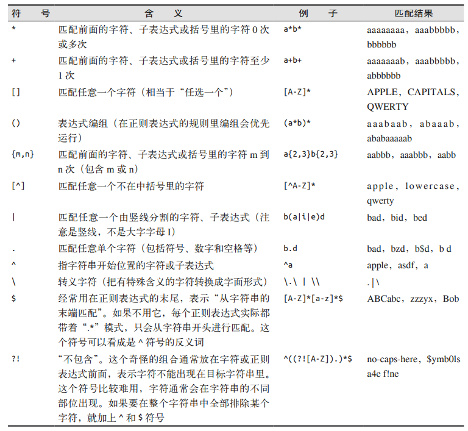
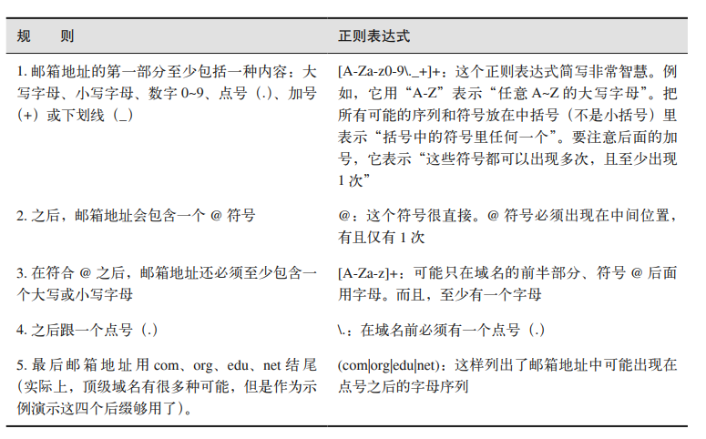

========================
BeautifulSoup(二)
========================

在 BeautifulSoup 第一篇章时，我们是直接通过使用 BeautifulSoup 对象的 ``.`` 标识符指定标签名来直接获取信息的（例如：``bs.head.title``），但是这种方法存在一定风险；因为当需要获取的信息在 HTML 文本的标签层中较深时效率不高或出现网站维护员更改 HTML 结构时会出错。

一般来说，对于过于复杂或不友好的网页有以下解决思路：

* 寻找 “打印此页” 的链接，或者看看网站是否有 HTML 样式更加友好的移动版。
* 寻找隐藏在 JavaScript 文件中的信息。

如果对于一般情况以及没有其他获取数据的途径，那么只能通过最简单但是比较不稳定的通过属性查找标签的方法。

让我们看以下一段代码了解该方法的使用：

.. literalinclude:: ../example_python/GetInfoFromSchool.py
   :language: python
   :lines: 30-34,36-39

对于 BeautifulSoup 对象以及 PageElement 对象或对象数组的查找信息的方法：

#. ``object.find('标签名',{'属性名',{'属性值','...'}})``；该方法会查找第一个满足条件的标签，并将该标签以及其子孙标签全部获取返回为 PageElement 。
#. ``object.find_all('标签名',{'属性名',{'属性值','...'}})``；该方法会查找所有满足条件的标签，并将所有标签以及其子孙标签全部获取返回为 PageElements (标签组) 。

.. tip:: 

   ``.get_text()`` 方法会清除调用该方法的 HTML 文本的所有标签，然后返回一个只包含文字的 Unicode 字符串。通常只有在准备打印、存储和操作最终数据时才应当使用 ``.get_text()`` 方法。一般情况下，应当尽可能地保留 HTML 文本地标签结构。

.. note:: 

   一般情况下，我们获取到一个标签，需要的数据大多是标签里的文本内容；但是，对于 ``<a>`` 以及 ```` 等特殊的标签，我们需要获取的其实是标签里某个属性的属性值。那么，我们该如何获取呢？

   很简单，使用标签属性名获取即可，类如： ``object.a['href']`` 或者 ``object.img['src']``

BeautifulSoup 的 find() 以及 find_all()
============================================

在 BeautifulSoup 文档里，这两个函数的定义如下：

* ``find(tag,attributes,recursive,text,keywords)``
* ``find_all(tag,attributes,recursive,text,limit,keywords)``

一般情况下，我们使用 BeautifulSoup 的 find() 以及 find_all() 这两个函数的前两个参数基本可以解决大多数问题，借助它们，我们可以通过标签的不同属性轻松过滤 HTML 文本，查找需要的标签组或单个标签；但是我们不妨了解以下这两个方法还能通过更多参数实现什么功能吧。

递归参数 recursive
-----------------------

**如果为True，则find_all（）将对该PageElement的子代执行递归搜索。 否则，将仅考虑直系子女。**

默认值为 True 。默认情况下 find_all() 函数会根据要求查找标签参数的所有子孙标签。如果设置为 False ，那么 find_all() 函数就只会根据查找文档的一级标签。

.. //todo :添加find_all(..,..,recursive=false)的实例

文本参数 text
-------------------------

文本参数 text 使用标签的文本内容去匹配的而不是用标签属性。

.. //todo :添加find_all(..,..,text='string')的实例

范围限制参数 limit
---------------------------

范围限制参数显然仅限于 find_all() 方法。当 limit=1 是等价于 find()。


关键字参数 keywords
-----------------------

如果针对 HTML 文本，我们只需要获取某个 id 的文本值，那么可以通过该方法实现 ：
``title=bs.find(id='title')``。

同样的，对于任何标签属性的特定值，我们通过此类方法获取 ``content=bs.find_all('',{'class':'green'})``，通过该方法我们可以获取 class 值为 green 的标签组，这些标签甚至可以是不同的标签类型。

为不产生歧义，统一写法为 ``object.find_all('',{'属性',{'属性值','...'}})``。
之所以这般写是因为对于关键字参数 class 而言，若使用 ``object.find(class='green')`` 形式的代码会出现语法错误，因为 class 在 python 中是一个关键字。


导航树
=========================


之前我们都是使用 find_all 函数通过标签的名称和属性来查找标签的。但是当我们需要基于标签在文档中的位置来查找标签时该如何？

我们在之前的代码中或多或少有体现出基于某个标签的位置来查找标签的行为，比如：

.. literalinclude:: ../example_python/GetInfoFromSchool.py
   :language: python
   :lines: 30-34

这段代码体现的就是这种思想。

处理子标签和其他后代标签
-----------------------------

一般情况下， BeautifulSoup 函数总是处理当前标签的后代标签。例如：

* ``bs.body.h1`` 选择了 body 标签中的第一个 h1 标签而不会找 body 之外的标签。
* 类似的， ``bs.div.find_all('img')`` 会找出 HTML 文本中第一个 div 标签，然后获取这个标签内的所有 img 标签的列表。

有时候，当我们只想获取当前标签下的子标签组时，那么可以使用 ``.children`` 来直接获取，该方法获取的是一个标签组。如：
``menus=bs.find('ul',{'class',{'menu-ul'}}).children`` 获取的是 ul 标签下的所有 li 子标签组。

但是当使用 ``.descendants`` 方法来获取，即``menus=bs.find('ul',{'class',{'menu-ul'}}).descendants`` ，得到的是所有后代标签组。

以惠州学院官网为例，分别用两种方法查找它的导航栏：

.. literalinclude:: ../example_python/GetNavigationFromHzu.py
   :language: python
   :linenos:

从运行结果可知，get_children_from_menu 方法打印出的只是 ul 标签的 li 子标签组，而get_descendants_from_menu 方法是遍历打印 ul 的所有后代标签，处理逻辑是先打印第一个 li 子标签，然后如果在该标签中还有标签，那么再遍历打印该标签的子标签，依据此法如此递归直至最后一层；处理完第一个 li 子标签之后，紧接着处理下一个，方法同处理第一个 li 标签的方法一样。

**从结果上来说，使用 ``.descendants`` 方法得到数据不好二次处理。**

处理兄弟标签
-----------------------------

BeautifulSoup 的 next_siblings() 函数使得从表格中收集数据变得十分简单。

如代码所示：

.. literalinclude:: ../example_python/GetBrotherInfo.py
   :language: python

由该方法的字面信息所说，**next_siblings() 只会获取调用了该方法的标签后面的兄弟标签**，类似地，**previous_siblings() 只会获取调用了该方法的标签前面的兄弟标签**

previous_sibling 以及 next_sibling 类似于 previous_siblings 以及 next_siblings ，区别在于前者返回的是单个标签，后者返回的是标签组。

处理父标签
-------------------

BeautifulSoup 的父标签查找函数 parent 和 parents 。

类如 ``bs.find('标签',{..}).parent`` 形式。


正则表达式常用符号
=========================



实例--邮箱字符串匹配
-----------------------



由此我们可以得出一个简单的邮箱匹配正则表达式：``[A-Za-z0-9\._+]+@[A-Za-z]+\.(com|org|edu|net)``

获取标签属性
===============

我们在之前曾尝试过直接通过标签获取某个属性，即类似于 ``object·div.a['href']``。

但是这种方法只能取得标签的一个属性，如果我们需要获取 ``<a>`` 标签的全部属性，那么可通过 ``.attrs`` 方法来获取，如： ``object·div.a.attrs``，该方法返回一个字典，包含了 object·div.a 标签的全部属性的键值对。

需要注意的是，``object·div.a.attrs['href']`` 与 ``object·div.a['href']`` 效果相同。