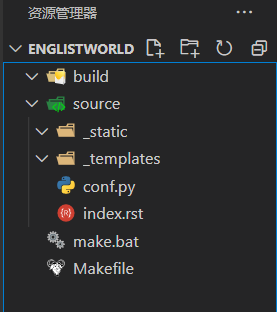

===============
准备部分
===============

安装python并下载必要的包
------------------------------

安装sphinx库以及sphinx-rtd-theme主题库。

.. code-block:: cmd

   pip install sphinx
   pip install sphinx-rtd-theme  

在项目根目录生成文档命令 ``sphinx-quickstart``
---------------------------------------------------

.. code-block:: shell

    > sphinx-quickstart

   Welcome to the Sphinx 3.4.3 quickstart utility.

   Please enter values for the following settings (just press Enter to
   accept a default value, if one is given in brackets).

   Selected root path: .

   # 是否分离source和build目录（输入y,选择分离，方便管理）
   You have two options for placing the build directory for Sphinx output.
   Either, you use a directory "_build" within the root path, or you separate
   "source" and "build" directories within the root path.
   > Separate source and build directories (y/n) [n]: y

   # 配置项目名，作者名，以及项目版本号
   The project name will occur in several places in the built documentation.
   > Project name: EnglishWorld
   > Author name(s): Eugene Forest
   > Project release []: 1.0   

   If the documents are to be written in a language other than English,
   you can select a language here by its language code. Sphinx will then
   translate text that it generates into that language.

   # 配置文档语言,默认为英语
   For a list of supported codes, see
   https://www.sphinx-doc.org/en/master/usage/configuration.html#confval-language.
   > Project language [en]: zh_CN

   Creating file C:\Users\qaz22\LinuxShare\ReadTheDocs\EnglistWorld\source\conf.py.
   Creating file C:\Users\qaz22\LinuxShare\ReadTheDocs\EnglistWorld\source\index.rst.
   Creating file C:\Users\qaz22\LinuxShare\ReadTheDocs\EnglistWorld\Makefile.
   Creating file C:\Users\qaz22\LinuxShare\ReadTheDocs\EnglistWorld\make.bat.

   Finished: An initial directory structure has been created.

   You should now populate your master file C:\Users\qaz22\LinuxShare\ReadTheDocs\EnglistWorld\source\index.rst and create other documentation
   source files. Use the Makefile to build the docs, like so:
      make builder
   where "builder" is one of the supported builders, e.g. html, latex or linkcheck.

最后生成的项目结构如下：

* build:用来存放通过make html生成文档网页文件的目录
* source：存放用于生成文档的源文件
* conf.py: Sphinx的配置文件
* index.rst: 主文档

配置主题
-----------------

在conf.py文件中配置以下属性以替换主题：

.. code-block:: python

   # 头部添加导入
   import sphinx_rtd_theme
   # 找到主题属性更改如下
   html_theme = 'sphinx_rtd_theme'

通过vscode的git插件创建存储库
-------------------------------

创建完之后，添加.gitignore文件以及README.md文件

本项目的.gitignore文件代码如下：

.. literalinclude:: ../../../.gitignore
   :language: git

本项目的README.md文件代码如下：

.. literalinclude:: ../../../README.md
   :language: markdown

推送
-------------------------

添加远程仓库，可以通过添加url添加仓库；如果使用了GitHub插件，那么可以直接选择并推送到现存的空仓库。