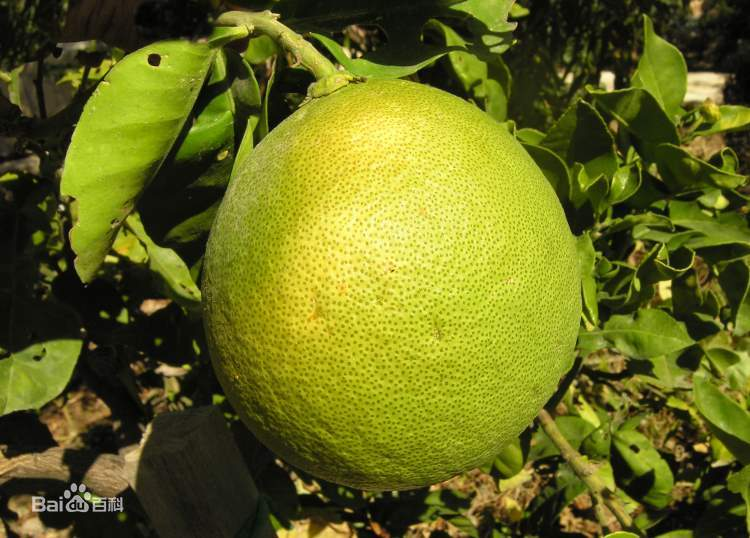

==============================
指令
==============================

epigraph 题词
====================

题词是一种适当的(合适的，恰当的或相关的)短题词，通常是引文或诗歌，在文件或章节的开头。

.. epigraph::

   No matter where you go, there you are.          
   -- Buckaroo Banzai

代码 ::

   .. epigraph::

      No matter where you go, there you are.

      -- Buckaroo Banzai

topic / 主题 or 总论
==========================

带有标题的段落。

.. topic:: Topic Title

   Subsequent indented lines comprise
   the body of the topic, and are
   interpreted as body elements.

----

.. code-block:: rest

   .. topic:: Topic Title

      Subsequent indented lines comprise
      the body of the topic, and are
      interpreted as body elements.

目录
================

由于REST没有连接多个文档或将文档拆分为多个输出文件的功能，因此Sphinx使用自定义指令在文档所组成的单个文件和目录之间添加关系。这个 toctree 指令是中心元素。

.. note:: 

   一个文件在另一个文件中的简单“包含”可以通过 |include| 指令。

.. |include| replace:: :ref:`include-directive`

文档标题 toctree 将自动从引用文档的标题中读取。如果这不是您想要的，您可以使用类似的语法来指定一个显式的标题和目标来放置超链接（和sphinx的 cross-referencing syntax ）这看起来像：

.. code-block:: rest

   .. toctree::
      :maxdepth: 2
      

      ./intro
      this is strings theme <./strings>
      datatypes
      ../../numeric
      (many more documents listed here)

.. note:: 

   更多关于目录的语法点击 `前往官网查看。 <https://www.osgeo.cn/sphinx/usage/restructuredtext/directives.html#table-of-contents>`_ 

sidebar 边注栏
====================

侧边栏的可选选项只有 subtitle 子标题。

.. sidebar:: Optional Sidebar Title
   :subtitle: Optional Sidebar Subtitle

   Subsequent indented lines comprise
   the body of the sidebar, and are
   interpreted as body elements.

.. code-block:: rest

   .. 侧边栏代码如下所示：

   .. sidebar:: Optional Sidebar Title
      :subtitle: Optional Sidebar Subtitle

      Subsequent indented lines comprise
      the body of the sidebar, and are
      interpreted as body elements.

image 与 figure 
========================

.. _image-directive:

image
-----------

For example ::

   .. image:: picture.jpeg
      :height: 100px
      :width: 200 px
      :scale: 50 %
      :alt: alternate text
      :align: right

* ``align`` 对齐: "top", "middle", "bottom", "left", "center", or "right"。“left”、“center”和“right”值控制图像的水平对齐，允许图像浮动，并让文本围绕它流动。 *值“top”、“middle”和“bottom”控制图像的垂直对齐(相对于文本基线);它们只对内联图像(替换)有用。*
* ``alt`` 替代文本，对图像的简短描述
* ``height`` 图片高；当“scale”选项也被指定时，它们将被合并。例如，一个200px的高度和50的比例相当于一个100px的高度没有比例。
* ``width`` 图片宽；当“scale”选项也被指定时，它们将被合并。
* ``scale`` 缩放，整数百分比(“%”符号是可选的)，默认是“100%”，即没有缩放。

----

柚（学名：Citrus maxima (Burm) Merr.）是芸香科、柑橘属植物。乔木。嫩枝、叶背、花梗、花萼及子房均被柔毛，嫩叶通常暗紫红色，嫩枝扁且有棱。叶质颇厚，色浓绿，阔卵形或椭圆形，连冀叶长9-16厘米，宽4-8厘米。总状花序，有时兼有腋生单花；花蕾淡紫红色，稀乳白色；花萼不规则5-3浅裂；花瓣长1.5-2厘米；雄蕊25-35枚，有时部分雄蕊不育。果圆球形，扁圆形，梨形或阔圆锥状，果皮甚厚或薄，海绵质，油胞大，凸起，果心实但松软，瓢囊10-15或多至19瓣；种子多达200余粒，亦有无子的，形状不规则，通常近似长方形，单胚。花期4-5月，果期9-12月。
原产东南亚，在中国已有3000多年栽培历史。浙江、江西、广东、广西、台湾、福建、湖南、湖北、四川、贵州、云南等省均有栽种。柚性喜温暖、湿润气候，不耐干旱。生长期最适温度23-29℃，能忍受-7℃低温。
柚的果实表皮、花、叶还可提取优质芳香油，果皮中可提取优质果胶，果肉可以加工成果汁、果酒、柠檬酸、果酱及罐头等。果实综合利用后经济效益可望增长4倍，柚的综合利用还有很大的发掘潜力。果肉含维生素C较高。有消食、解酒毒功效。

----

代码 ::

   .. image:: ../img/grapefruit.jfif
      :alt: hzw
      :scale: 50%
      :align: right
   
   ... 文字文章 ...

.. _figure-directive:

figure 
==================

带标题和可选图例的图像

代码样例 ::

   .. figure:: picture.png
      :scale: 50 %
      :alt: map to buried treasure

      This is the caption of the figure (a simple paragraph).【标题】

      The legend consists of all elements after the caption.  In this
      case, the legend consists of this paragraph and the following
      table:（以下为图例）

      +-----------------------+-----------------------+
      | Symbol                | Meaning               |
      +=======================+=======================+
      | .. image:: tent.png   | Campground            |
      +-----------------------+-----------------------+
      | .. image:: waves.png  | Lake                  |
      +-----------------------+-----------------------+
      | .. image:: peak.png   | Mountain              |
      +-----------------------+-----------------------+

----

   柚（学名：Citrus maxima (Burm) Merr.）

   The legend consists of all elements after the caption.  In this
   case, the legend consists of this paragraph and the following
   table:

   +-----------------------------------+------------+
   | Symbol                            | Meaning    |
   +===================================+============+
   | .. image:: ../img/grapefruit.jfif | Campground |
   +-----------------------------------+------------+
   | .. image:: ../img/grapefruit.jfif | Campground |
   +-----------------------------------+------------+
   | .. image:: ../img/grapefruit.jfif | Campground |
   +-----------------------------------+------------+

----

实例代码 ::

   .. figure:: ../img/grapefruit.jfif
      :alt: 柚子
      :height: 100px
      :width: 200 px
      :scale: 100%
      :align: right

      柚（学名：Citrus maxima (Burm) Merr.）

      The legend consists of all elements after the caption.  In this
      case, the legend consists of this paragraph and the following
      table:

      +-----------------------------------+------------+
      | Symbol                            | Meaning    |
      +===================================+============+
      | .. image:: ../img/grapefruit.jfif | Campground |
      +-----------------------------------+------------+
      | .. image:: ../img/grapefruit.jfif | Campground |
      +-----------------------------------+------------+
      | .. image:: ../img/grapefruit.jfif | Campground |
      +-----------------------------------+------------+
   

HTML细节
=====================

meta 指令
----------

生成HTML <meta> 标签。

.. meta:: 
   :keyword: 尤金森林笔记
   :description lang=en: An amusing story
   :description lang=fr: Une histoire amusante
   :description lang=zh_CN: 尤金森林
   :http-equiv=Content-Type: text/html; charset=utf-8

代码如下：

.. code-block:: rest

   .. meta:: 
      :keyword: 尤金森林笔记
      :description lang=en: An amusing story
      :description lang=fr: Une histoire amusante
      :description lang=zh_CN: 尤金森林
      :http-equiv=Content-Type: text/html; charset=utf-8

指令参数值对照HTML

.. code-block:: rest

   .. meta::
      :description: The reStructuredText plaintext markup language
      :keywords: plaintext, markup language
      :http-equiv=Content-Type: text/html; charset=ISO-8859-1

   
   .. This would be converted to the following HTML:

   <meta name="description" content="The reStructuredText plaintext markup language">
   <meta name="keywords" content="plaintext, markup language">
   <meta http-equiv="Content-Type" content="text/html; charset=ISO-8859-1">

.. code-block:: rest

   .. meta::
      :description lang=en: An amusing story
      :description lang=fr: Une histoire amusante

   .. This would be converted to the following HTML:

   <meta name="description" lang="en" content="An amusing story">
   <meta name="description" lang="fr" content="Une histoire amusante">

title 指令
------------------

"title"指令将文档标题指定为元数据，它不会成为文档主体的一部分。 **它覆盖文档提供的文档标题和“title”配置设置。** 例如，在HTML输出中，元数据文档标题出现在浏览器窗口的标题栏中。

.. title:: 指令学习

.. code-block:: rest

   .. 在此代码块上的代码为：

   .. title::  指令学习

替代指令 replace
==================

my |name| is |caution|

.. |name| replace:: replacement *text*

.. raw:: html

   

.. code-block:: rest

   my |name| is |caution|

   .. |name| replace:: replacement *text*

   .. |caution| image:: ../img/grapefruit.jfif
               :alt: hzw
               :scale: 50%

.. important:: 

   **如果要对所有文档使用某些替换，请将它们放入 rst_prolog 或 rst_epilog 或者将它们放在单独的文件中，并将其包含到所有要在其中使用它们的文档中，使用 include 指令。** （确保为include文件提供与其他源文件不同的文件扩展名，以避免sphinx将其作为独立文档查找。）

   **文档系统提供三个默认定义的替换。** 它们在构建配置文件中设置。

   * ``|release|`` 由项目发布替代，文件参考。这是一个完整的版本字符串，包括alpha/beta/release候选标记，例如 2.5.2b3 . 通过设置 release .
   * ``|version|`` 替换为文档引用的项目版本。这意味着只包含主要和次要版本的部分，例如 2.5 ，即使是2.5.1版。通过设置 version .
   * ``|today|`` 替换为今天的日期（文档的读取日期）或生成配置文件中设置的日期。通常有格式 April 14, 2007 . 通过设置 today_fmt 和 today .

