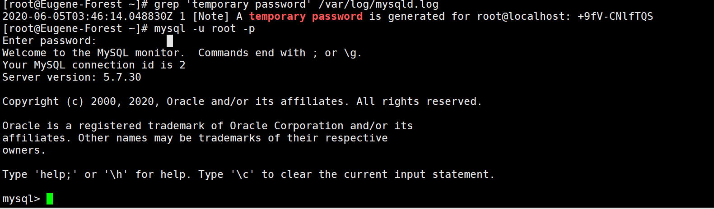

========================
MySQL管理
========================

.. note:: 
   对mysql操作的一些记录。操作于centos7。使用 :ref:`阿里yum源 <config-ali-yum>` 安装软件。

.. _install-mysql-at-linux:

安装mysql server
-------------------------

使用yum命令安装：``yum install -y mysql-community-server``

.. note:: 

   如果出现mysql的yum源缺失，需重新下载，可前往 :ref:`安装mysql-server的yum源笔记记录 <install-mysql-server-yum>` 查看。

.. code-block:: shell

   # 安装之后运行命令rpm -qa | grep mysql可见已经安装的mysql相关软件
   [root@eugene-forest ~]# rpm -qa | grep mysql
   mysql-community-common-5.7.30-1.el7.x86_64
   mysql57-community-release-el7-8.noarch
   mysql-community-server-5.7.30-1.el7.x86_64
   php70w-mysqlnd-7.0.33-1.w7.x86_64
   mysql-community-client-5.7.30-1.el7.x86_64
   mysql-community-libs-compat-5.7.30-1.el7.x86_64
   mysql-community-libs-5.7.30-1.el7.x86_64

对mysql的系统配置
-----------------

systemctl命令：

* ``systemctl start mysqld`` 
* ``systemctl status mysqld``
* ``systemctl enabled mysqld`` 自启动mysql，可以与重新加载服务配置文件命令配合使用 ``systemctl daemon-reload``
* ``systemctl restart mysqld``

-------------
启动mysql
-------------

.. code-block:: shell

   systemctl start mysqld
   # 查看mysql状态
   systemctl status mysqld

-----------------
开机自启动mysql
-----------------

.. code-block:: shell

   systemctl enabled mysqld
   # 重新加载服务配置文件
   systemctl restart mysqld

修改MySQL server 的默认密码（第一次启动）
---------------------------------------------

mysql安装完成之后，在 **/var/log/mysqld.log** 文件中给root生成了一个默认密码。

通过下面的方式找到root默认密码，然后登录mysql进行修改登陆密码：

.. code-block:: shell

   shell> grep 'temporary password' /var/log/mysqld.log
   shell> mysql -u root -p 

.. code-block:: mysql

   mysql> set password for 'root'@'localhost'=password('MyNewPass4!');

.. note:: 
   mysql5.7默认安装了密码安全检查插件（validate_password），**默认密码检查策略要求密码必须包含：大小写字母、数字和特殊符号，并且长度不能少于8位**。否则会提示ERROR 1819 (HY000): Your password does not satisfy the current policy requirements错误

----

mysql添加一个用户并为其添加某个数据库的某些权限
-------------------------------------------------

--------------
创建用户
--------------

在创建用户之前，我们先要了解mysql中存储用户数据的表在哪里。实际上该表是mysql.user。

.. code-block:: sql

   mysql> use mysql;
   Database changed
   mysql> select host,user from user;
   +-----------+------------------+
   | host      | user             |
   +-----------+------------------+
   | %         | bms              |
   | %         | spring-boot-user |
   | localhost | mysql.session    |
   | localhost | mysql.sys        |
   | localhost | root             |
   +-----------+------------------+
   5 rows in set (0.11 sec)

其中，host列存储的是允许用户登录的IP地址，user列存储的是用户名。
当host值为 ``%`` 时允许用户在任何地址登录，而为 ``localhost`` 时，只允许用户在（与数据库相同地址）本地登录。
当然，也可以限制host在某个地址（比如局域网）登录。

在mysql数据库中，执行以下命令即可创建用户： 

* ``create user 'test-user'@'%' identified by 'passwrod'``
* ``create user 'test-user'@'localhost' identified by 'passwrod'``

----

--------------
给用户添加权限
--------------

* 查看用户权限： ``show grants for user_name('user_name'@'host')``
* 给用户添加权限：
   * ``grant all on DatabaseName.table_name to user_name`` 将某个数据库的某个表的所有权限赋予用户
   * ``grant all on *.* to user_name`` 将mysql所有的数据库的所有权限赋予给用户

.. code-block:: sql

   mysql> show grants for bms;
   +----------------------------------------------+
   | Grants for bms@%                             |
   +----------------------------------------------+
   | GRANT USAGE ON *.* TO 'bms'@'%'              |
   | GRANT ALL PRIVILEGES ON `BMS`.* TO 'bms'@'%' |
   +----------------------------------------------+
   2 rows in set (0.11 sec)

常用用户权限一览：

+----------------+------------------------------------------------+
|      权限      |                      说明                      |
+================+================================================+
| ALL            | 对数据库的全部操作权限                         |
+----------------+------------------------------------------------+
| CREATE         | 允许使用创建新数据库和表的语句                 |
+----------------+------------------------------------------------+
| CREATE ROUTINE | 允许使用创建存储例程（存储过程和函数）的语句   |
+----------------+------------------------------------------------+
| CREATE VIEW    | 启用CREATE VIEW语句的使用                      |
+----------------+------------------------------------------------+
| DROP           | 允许使用删除（删除）现有数据库，表和视图的语句 |
+----------------+------------------------------------------------+
| DELETE         | 允许从数据库表中删除行                         |
+----------------+------------------------------------------------+
| UPDATE         | 使行可以在数据库的表中更新                     |
+----------------+------------------------------------------------+
| SELECT         | 允许从数据库的表中选择行                       |
+----------------+------------------------------------------------+
| INSERT         | 使行可以插入数据库的表中                       |
+----------------+------------------------------------------------+
| ALTER          | 允许使用该ALTER TABLE语句更改表的结构          |
+----------------+------------------------------------------------+

`详细权限说明点击链接前往官网 <https://dev.mysql.com/doc/refman/5.7/en/privileges-provided.html>`_ 。

.. note:: 
   需要注意的是，有些权限可能会有一些限制，比如alter权限，需要 CREATE和 INSERT特权。这些权限的前提条件详细情况前往官网查看。

----

--------------
移除用户权限
--------------

* ``revoke <privileges> on <Database>.<table> from user_name@host``

----

-----------
刷新权限
-----------

在修改了用户权限之后要及时生效要对权限进行刷新以及时更新权限表。

* ``flush privileges``

----

-------------
删除用户
-------------

同一般对表的记录的处理相同，只是通过 ``delete from table_name where expression`` 来删除。

.. code-block:: sql

   mysql> delete from user where user='bms' and host='%';
   Query OK, 1 row affected (0.08 sec)

----

数据库连接数达到上限导致应用服务出现错误
---------------------------------------------

| Can not connect to MySQL server
| Error: Too many connections

对于这种情况，需要对数据库的默认连接数限制进行修改，或者是修改每次连接的有效时长。

.. code-block:: sql

   mysql> show variables like '%max_connections%';
   +-----------------+-------+
   | Variable_name   | Value |
   +-----------------+-------+
   | max_connections | 151   |
   +-----------------+-------+
   1 row in set (0.16 sec)

对于mysql来说，默认最大连接数是151。可通过命令增大可连接数。

.. code-block:: sql

   mysql> set global max_connections=1000;

与此同时，还可以通过修改每次连接的最大时长。

.. code-block:: sql

   mysql> show global variables like 'wait_timeout' ;
   +---------------+-------+
   | Variable_name | Value |
   +---------------+-------+
   | wait_timeout  | 28800 |
   +---------------+-------+
   1 row in set (0.14 sec)

   mysql> set global wait_timeout=300;

.. note:: 
   以上的配置是临时修改，重启mysql会失效。要想要配置完全修改，需要对脚本文件（/etc/my.cnf这个文件）进行修改（在[mysqld] 中新增max_connections=N）。

   