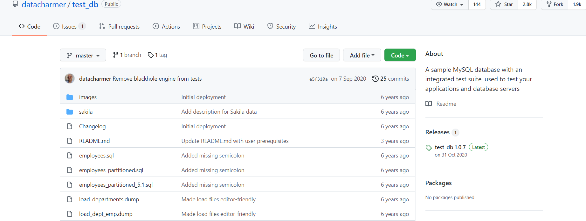

================================
关于 MySQL 测试库的下载和安装
================================

.. _mysql_test_db_installer:

下载 test_db 库
==================

首先，前往 GitHub 仓库下载 `datacharmer/test_db <https://github.com/datacharmer/test_db>`_  项目 。

.. note:: 

    如果无法连接 Github 可在 Gitee 中搜索 test_db 查看相关项目，有许多 fork test_db 的项目。如 `xudayjt/test_db <https://gitee.com/xudayjt/test_db?_from=gitee_search>`_  

安装 employees 库
===========================

下载完目标项目后，我们要通过命令行来安装测试仓库。

.. attention:: 

    直接参考项目的 README.MD 文件即可，在此只需要注意命令的运行格式以及文件位置。

如在 Linux 下安装：

.. code-block:: bash

    # 安装
    [root@eugene-forest test_db]$ mysql -t -u root -p < employees.sql 
    Enter password: 
    
    +-----------------------------+
    | INFO                        |
    +-----------------------------+
    | CREATING DATABASE STRUCTURE |
    +-----------------------------+
    +------------------------+
    | INFO                   |
    +------------------------+
    | storage engine: InnoDB |
    +------------------------+
    +---------------------+
    | INFO                |
    +---------------------+
    | LOADING departments |
    +---------------------+
    +-------------------+
    | INFO              |
    +-------------------+
    | LOADING employees |
    +-------------------+
    +------------------+
    | INFO             |
    +------------------+
    | LOADING dept_emp |
    +------------------+
    +----------------------+
    | INFO                 |
    +----------------------+
    | LOADING dept_manager |
    +----------------------+
    +----------------+
    | INFO           |
    +----------------+
    | LOADING titles |
    +----------------+
    +------------------+
    | INFO             |
    +------------------+
    | LOADING salaries |
    +------------------+

    # （回车/enter）

    +---------------------+
    | data_load_time_diff |
    +---------------------+
    | 00:00:28            |
    +---------------------+

测试 [#]_ 
-------------

.. code-block:: bash

    # 测试
    [root@eugene-forest test_db]$ mysql -t -u root -p < test_employees_md5.sql
    Enter password: 
    
    +----------------------+
    | INFO                 |
    +----------------------+
    | TESTING INSTALLATION |
    +----------------------+
    +--------------+------------------+------------------------------------------+
    | table_name   | expected_records | expected_crc                             |
    +--------------+------------------+------------------------------------------+
    | departments  |                9 | 4b315afa0e35ca6649df897b958345bcb3d2b764 |
    | dept_emp     |           331603 | d95ab9fe07df0865f592574b3b33b9c741d9fd1b |
    | dept_manager |               24 | 9687a7d6f93ca8847388a42a6d8d93982a841c6c |
    | employees    |           300024 | 4d4aa689914d8fd41db7e45c2168e7dcb9697359 |
    | salaries     |          2844047 | b5a1785c27d75e33a4173aaa22ccf41ebd7d4a9f |
    | titles       |           443308 | d12d5f746b88f07e69b9e36675b6067abb01b60e |
    +--------------+------------------+------------------------------------------+
    ERROR 1271 (HY000) at line 60: Illegal mix of collations for operation 'concat_ws'

----

.. [#] 2021年11月10日测试未成功。 ERROR 1271 (HY000) at line 60: Illegal mix of collations for operation 'concat_ws' 。