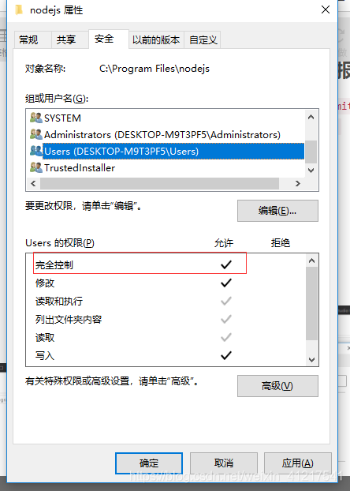

=============================================================================================================================
npm ERR!
=============================================================================================================================

权限错误如：Error: EPERM: operation not permitted, mkdir 'C:\\Program Files\\nodejs\\node_cache\\_locks' 的问题
-----------------------------------------------------------------------------------------------------------------------------

场景：win10下安装node之后，node -v，npm -v都正常，node安装成功，但是运行npm i或者全局安装某插件时，报错： ``Error: EPERM: operation not permitted, mkdir 'C:\\Program Files\\nodejs\\node_cache\\_locks'``

**原因：node目录权限不够**

解决方法：

   **找到node安装目录，右键属性，点击安全，设置users用户完全控制权限**

