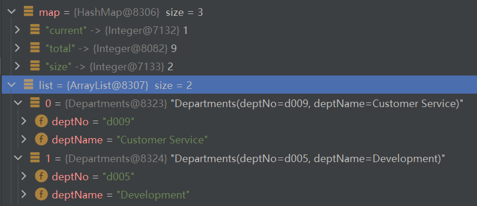
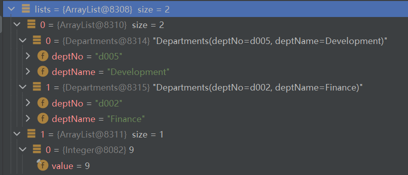

=====================
分页查询
=====================

.. warning:: 

    2021年11月10日，完成 MySQL 的测试，但是还没有完成 SQL Server 的测试。

适用于 MySQL 。

.. _business_paging:

分页通用方法（Spring Boot）
====================================

1. 简单查询，并通过 mybatis-plus 分页插件进行分页； 【 **对于数据量大的表不推荐此分页查询** 】
2. 使用存储过程分页查询，并在目标结果集的每条记录中都添加total字段 ； （X）
3. 使用存储过程分页查询，并用 ``OUT`` 型参数接收数据总条数 total； （√）
4. 简单分页查询，mybatis 中编写 xml 文件查询返回多结果，并使用 ``List<List<?>>`` 接收接收（mapper层）； （需要类型转换是比较麻烦，特别是需要对结果集进行二次处理时） 
5. 存储过程中多次查询产生多个结果集，并使用 ``List<List<?>>`` 接收（mapper层） 
6. 使用 mybatis 插件 PageHelper (`前往官网查看如何使用 mybatis 分页插件 PageHelper <https://pagehelper.github.io/docs/howtouse/>`_ )；

【 **笔者窃以为不要再实际业务中使用 List<List<?>> 接收结果集** 】

.. raw:: html

    

spring boot + mybatis-plus 项目中实现分页
==============================================

1. 添加分页插件的配置
2. 使用 Page<T> 来封装分页参数
3. 使用 IPage<T> 来封装分页数据

此方法可直接 `前往官网查看如何使用 mybatis-plus 分页插件 <https://mp.baomidou.com/guide/page.html>`_ 

.. raw:: html

    

spring boot + mybatis 项目中实现分页
=========================================

使用存储过程的分页查询
-------------------------

.. code-block:: sql

    -- 存储过程
    CREATE PROCEDURE `page_dept`(
        -- 查询页码
        IN current INT,
        -- 页大小
        IN size INT,
        -- 总条数
        OUT record_total INT
    )
    BEGIN
        DECLARE offset_size INT DEFAULT 0;
        SET offset_size=(current-1)*size;
        SELECT SQL_CALC_FOUND_ROWS * FROM departments LIMIT offset_size,size;
        SET record_total=FOUND_ROWS();
    END

.. code-block:: xml

    <!-- xml 层-->
    <resultMap id="BaseResult" type="com.example.sqlstudying.entity.Departments">
        <result column="dept_name" property="deptName"/>
        <result column="dept_no" property="deptNo"/>
    </resultMap>

    <select id="page" statementType="CALLABLE"  resultMap="BaseResult">
        {call page_dept(#{current,mode=IN},#{size,mode=IN},#{total,mode=OUT,jdbcType=INTEGER})}
    </select>

.. code-block:: java

    //mapper 层
    List<Departments> page(Map<String,Object> map);

    //service实现层
    Map map=new HashMap();
    map.put("current", current);
    map.put("size", size);
    List<Departments> list= departmentsMapper.page(map);
    //System.out.println(map.get("total"));
    // 执行方法后 map 将会接收到 total 参数

.. note:: 

    如果出现需要指定参数类型的情况，那么可以在 xml 文件中添加参数的映射，如：
    
    .. code-block:: xml

        <parameterMap id="params" type="map">
            <parameter property="current" jdbcType="INTEGER" mode="IN"/>
            <parameter property="size" jdbcType="INTEGER" mode="IN"/>
            <parameter property="total" jdbcType="INTEGER" mode="OUT"/>
        </parameterMap>

使用 xml 文件定义分页查询
-----------------------------

.. code-block:: xml

    <!--xml 层-->
    <resultMap id="BaseResult" type="com.example.sqlstudying.entity.Departments">
        <result column="dept_name" property="deptName"/>
        <result column="dept_no" property="deptNo"/>
    </resultMap>

    <resultMap id="Total" type="integer">
    </resultMap>

    <select id="page_xml" resultMap="BaseResult,Total">
        SELECT SQL_CALC_FOUND_ROWS * FROM departments LIMIT #{offset},#{size};
        SELECT FOUND_ROWS() as total;
    </select>

.. code-block:: java

    // mapper 层
    List<List<?>> page_xml(Integer offset,Integer size);
    
    // service 实现层
    List<List<?>> lists=departmentsMapper.page_xml(1, 2);

.. warning:: 

    此方法需要注意的是，要在数据库连接配置中允许执行多语句。(添加 ``allowMultiQueries=true`` )

    如： ``jdbc:mysql://localhost:3306/employees?characterEncoding=utf8&allowMultiQueries=true``

