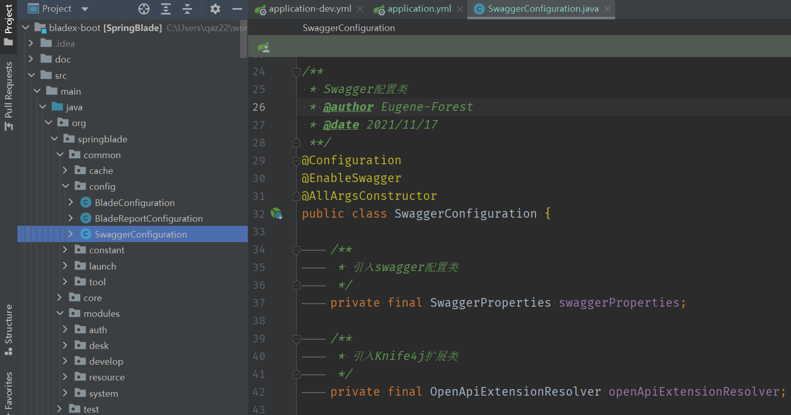
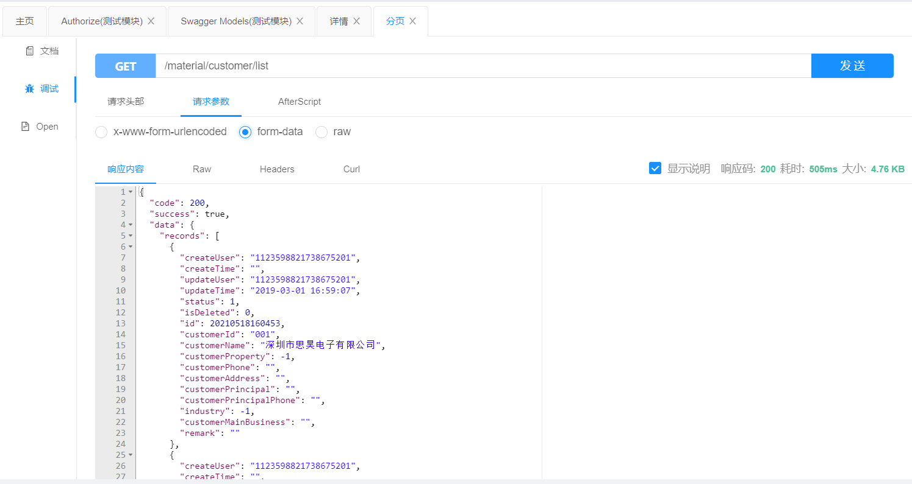
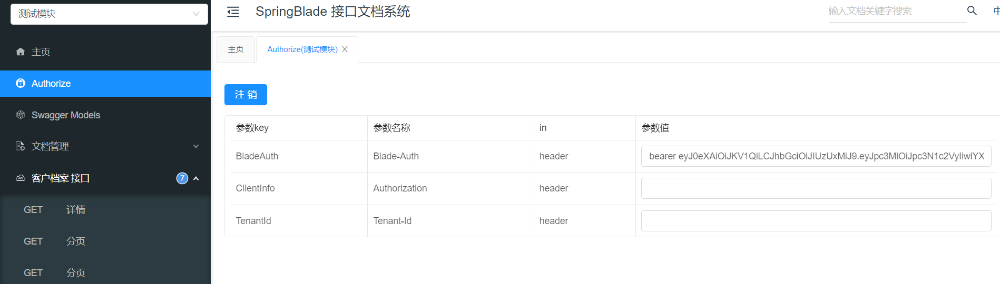
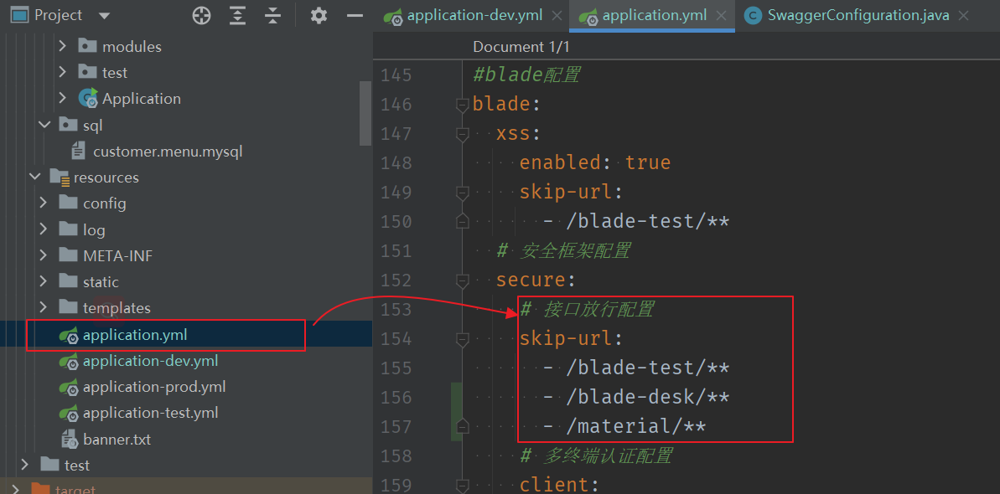
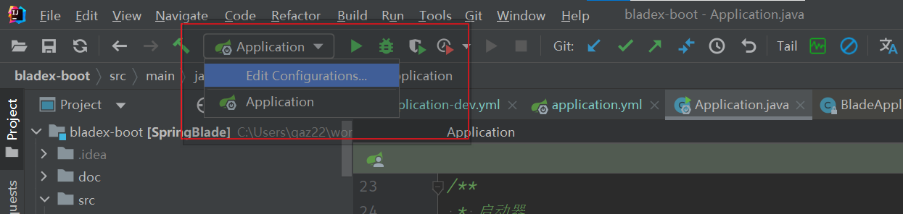
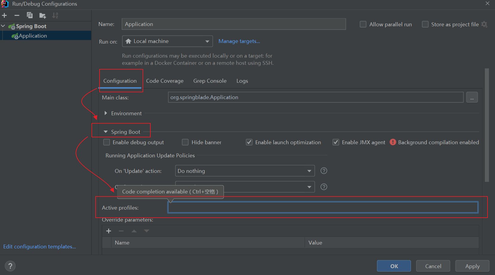
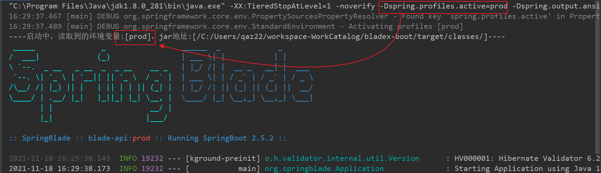
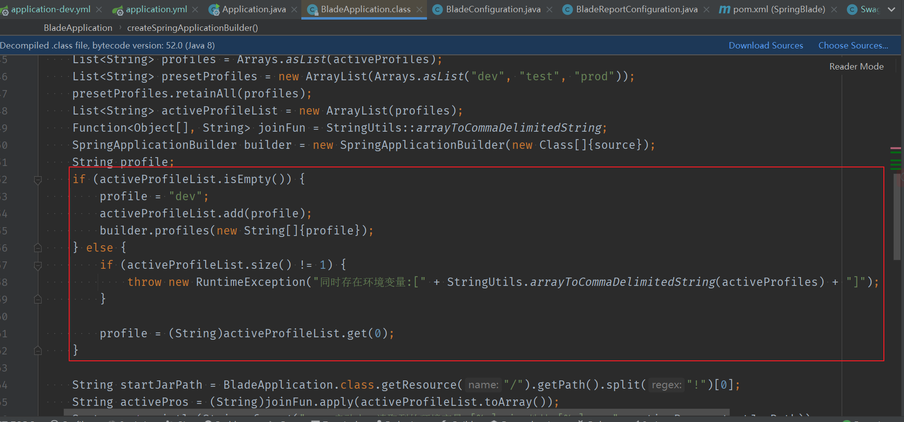

================================
Swagger 接口文档系统功能
================================

本篇章偏重于讲解 Blade 的接口文档系统的使用，同时对构成接口文档的相关注解的使用和使用效果进行说明。

|75|

如何新建一个接口文档模块
==============================

找到 ``SwaggerConfiguration`` 配置文件，在我们做过的 mes 和 wms 项目中的 ``org/springblade/common/config`` 包下有已经定义好的 swagger 配置文件。

或者根据下方 swagger 配置文件的基本结构创建一个配置文件。

.. literalinclude:: ./file/SwaggerConfiguration.java
    :language: java

    
    swagger 配置文件

|30|

调试功能以及配置接口放行
------------------------------

即模拟客户端向服务端发出网络请求的功能。

    调试功能的使用

但是，在默认情况下，我们要像后端发起请求时，需要添加一些头部验证信息。

例如上文中的调试功能，如果没有在Authorize 授权面板中设置头部信息，那么会出现 *请求未授权* 的错误：

.. code-block:: json

    {
    "code": 401,
    "success": false,
    "data": null,
    "msg": "请求未授权"
    }

虽然我们可以通过swagger 接口文档功能中的 Authorize 授权面板中设置头部信息，但是我们在开发测试时可以直接将需要调试的接口开放，这样更加简便。当然， **测试完成之后要将其删除或注释**

    Authorize 授权面板中设置头部信息

    在安全框架配置中设置接口开放

   

   

|50|

关于 @profile 注解
==========================

@profile注解是spring提供的一个用来标明当前运行环境的注解。

解读 Spring @Profile 的用法

|30|

运行环境的设置
----------------

* 点击编辑 idea 的运行配置

   编辑 idea 的运行配置

* 根据菜单 :menuselection:`configuration --> spring boot --> Active profiles`  找到 Active profiles 配置

    找到 Active profiles 并添加目标运行环境设置

* 假如在 Active profiles 中填入 prod ，那么运行后如下图所示：（其实就是在命令行运行Class文件时添加运行参数）

   运行 prod 环境下的项目

* 当 Active profiles 中不带有参数时，那么根据 Blade X 框架的自身配置来说，会自动设置为dev 。

    BladeApplication 对 Active profiles 的默认配置

|50|

关于 swagger api 注解的使用
================================

