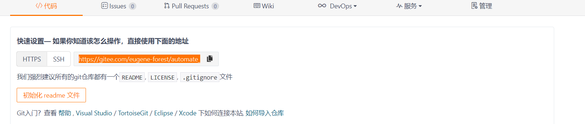

======================================================
在jetbrains系列软件中使用版本控制（gitee-initial）
======================================================

.. _jetbrains-gitee:

准备
------

* gitee账户 【 `官网 <https://gitee.com/>`_ 】
* idea软件
* 创建gitee空仓库
* 在idea中创建项目

----

在jetbrains系列软件的项目中启用版本管理
------------------------------------------

选择版本控制系统为 **Git**
--------------------------------------

.. note:: 
   到此步，本地仓库创建完成。可以在本地实现版本控制。

将项目提交到本地仓库中
-------------------------

.. note:: 
   在此步中，提交作者最好写上。

将本地项目推送到gitee仓库中
--------------------------------

---------------------
获取仓库http链接
---------------------

------------------
点击推送
------------------

由上图可知，需要添加远程仓库。我们将gitee仓库的链接添加入即可。完成后显示如下，然后点击推送。

--------------
添加远程仓库
--------------

-----------------
gitee账户登录
-----------------

如果是第一次推送，则会出现gitee账户登录的弹窗。如图：

-----------------
登录成功并推送
-----------------

登录成功并推送之后，如下图

