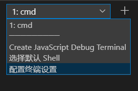
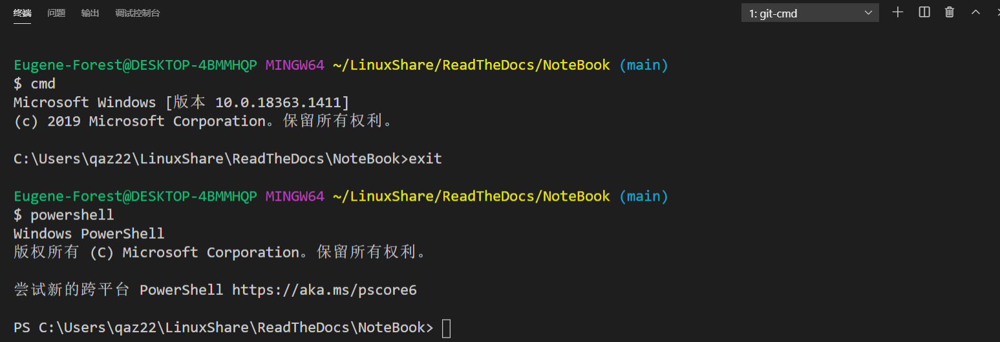

关于配置vscode的终端问题
==================================

.. note:: 
   最基本的方法是通过修改.vscode文件夹下的setting.json文件的 ``"terminal.integrated.shell.windows":`` 属性来修改。

| 具体路径具体分析更改

.. code-block:: 
   
   // Command Prompt 　　
   "terminal.integrated.shell.windows": "C:\\Windows\\System32\\cmd.exe" 　　

   // PowerShell 　　
   "terminal.integrated.shell.windows": "C:\\Windows\\System32\\WindowsPowerShell\\v1.0\\powershell.exe" 　　

   // Git Bash 　　
   "terminal.integrated.shell.windows": "C:\\Program Files\\Git\\bin\\bash.exe" 　　
   

.. warning:: 
   这种方法更改后的shell终端只能开启一种类型（cmd,powershell,bash其中一种）；如果我要在vscode中新建多个类型终端如cmd,powershell,bash，这个如何实现？

----

**最终使用方案：**

.. code-block:: json

   "terminal.integrated.shellArgs.windows": [
    "--command=usr/bin/bash.exe",
    "-l",
    "-i"
    ]
    // Bash on Ubuntu (on Windows)
    "terminal.integrated.shell.windows": "C:\\Program Files\\Git\\git-cmd.exe"

