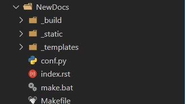
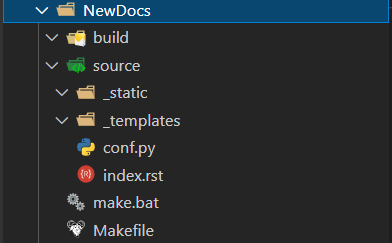

===============
准备部分
===============

.. note:: 

   Sphinx 项目需要 Python 环境来支持,在此不对如何安装 Python 进行说明. 有需要的可以通过 `Python官网 <https://www.python.org/>`_ 单独下载.

安装 Sphinx 并下载必要的包
------------------------------

安装 Sphinx 库以及 ``sphinx-rtd-theme`` 主题库。

.. code-block:: guess

   pip install sphinx
   pip install sphinx-rtd-theme  

|30|

在项目根目录运行生成文档命令 ``sphinx-quickstart``
---------------------------------------------------

.. code-block:: shell

   Eugene-Forest@DESKTOP-4BMMHQP MINGW64 ~/workspace-vscode/ReadTheDocs/NewDocs
   $ sphinx-quickstart
   欢迎使用 Sphinx 4.3.2 快速配置工具。

   请输入接下来各项设置的值（如果方括号中指定了默认值，直接
   按回车即可使用默认值）。

   已选择根路径：.

   有两种方式来设置 Sphinx 输出的创建目录：
   一是在根路径下创建“_build”目录，二是在根路径下创建“source”
   和“build”两个独立的目录。
   > 独立的源文件和构建目录（y/n） [n]: 

   项目名称将会出现在文档的许多地方。
   > 项目名称: newbooks
   > 作者名称: eugene
   > 项目发行版本 []: 0.1

   如果用英语以外的语言编写文档，
   你可以在此按语言代码选择语种。
   Sphinx 会把内置文本翻译成相应语言的版本。

   支持的语言代码列表见：
   http://sphinx-doc.org/config.html#confval-language。
   > 项目语种 [en]: zh_CN

   创建文件 C:\Users\qaz22\workspace-vscode\ReadTheDocs\NewDocs\conf.py。
   创建文件 C:\Users\qaz22\workspace-vscode\ReadTheDocs\NewDocs\index.rst。
   创建文件 C:\Users\qaz22\workspace-vscode\ReadTheDocs\NewDocs\Makefile。
   创建文件 C:\Users\qaz22\workspace-vscode\ReadTheDocs\NewDocs\make.bat。

   完成：已创建初始目录结构。

   你现在可以填写主文档文件 C:\Users\qaz22\workspace-vscode\ReadTheDocs\NewDocs\index.rst 并创建其他文档源文件了
   。 用 Makefile 构建文档，例如：
   make builder
   此处的“builder”是支持的构建器名，比如 html、latex 或 linkcheck。

最后生成的项目结构如下：

* build 、 _build 文件夹: 用来存放通过make html生成文档网页文件
* source 文件夹: 存放用于生成文档的源文件
* conf.py 文件: Sphinx的配置文件
* index.rst 文件: 主文档
* _static 、 _template 文件夹: 用来存放静态文件或模板html

   
   非独立的源文件和构建目录

   
   独立的源文件和构建目录
   

|30|

配置主题
-----------------

在conf.py文件中配置以下属性以替换主题：

.. code-block:: python

   # 头部添加导入
   import sphinx_rtd_theme
   # 找到主题属性更改如下
   html_theme = 'sphinx_rtd_theme'

.. note:: 

   更多主题配置点击查看  :ref:`HTML Theme <sphinx-html-theme>`  笔记.

|30|

通过vscode的git插件创建存储库
-------------------------------

创建完之后，添加.gitignore文件以及README.md文件

本项目的.gitignore文件代码如下：

.. literalinclude:: ../../../.gitignore
   :language: git

本项目的README.md文件代码如下：

.. literalinclude:: ../../../README.md
   :language: markdown

|30|

推送
-------------------------

添加远程仓库，可以通过添加url添加仓库；如果使用了GitHub插件，那么可以直接选择并推送到现存的空仓库。

|30|

不同文件下的 tab 键行为控制
-------------------------------

这个功能配置可选择性添加，如果不使用 rst 文件编写笔记，那么这个功能也没有用；但是如果你打算使用 rst 文件编写笔记，甚至打算使用 rst 和 md 文件混合编写笔记，那么就有必要控制 tab 键的行为，因为 RestructureText 语法中的指令的内容和可选项都需要缩进 **3个空格**。，虽然可以连击三个 space，但是显然直接使用 tab 键更快捷。

由于笔者使用 VsCode 编写笔记，然后发现通过分别设置 用户、工作区、文件夹的 ``settings.json`` 文件中的  ``"editor.tabSize": 3`` 属性都没有很好的设置到 tab 的空格数。所以笔者索性通过插件 *EditorConfig for Visual Studio Code* 使用 ``.editorconfig`` 文件来格式化不同文件下的 tab 键。

.. code-block:: guess
   :caption: .editorconfig 文件
   :linenos:

   # EditorConfig is awesome: https://EditorConfig.org

   # top-most EditorConfig file 表示是最顶层的配置文件，发现设为true时，才会停止查找.editorconfig文件
   root = true

   # Set default charset
   [*.{rst,py,md,txt,html,xml,java}]
   charset = utf-8

   # Unix-style newlines with a newline ending every file 对于所有的文件 始终在文件末尾插入一个新行
   [*]
   end_of_line = lf
   insert_final_newline = true

   # 4 space indentation 控制py文件类型的缩进大小
   [*.{py,md,java}]
   indent_style = space
   indent_size = 4

   [*.rst]
   indent_style = space
   indent_size = 3

